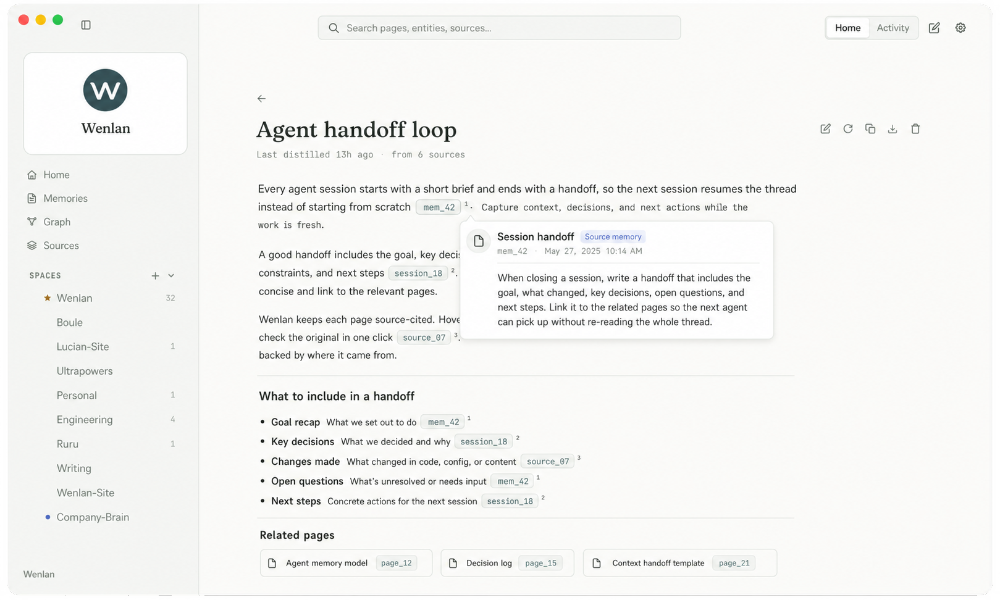

<p align="center">
  <picture>
    <source media="(max-width: 600px)" srcset="./docs/assets/readme-banner-mobile.png">
    
  </picture>
</p>

El trabajo útil con IA no debería desaparecer cuando termina una conversación. Wenlan construye las páginas adecuadas y las mantiene actualizadas a medida que las fuentes cambian, solicitando intervención solo cuando se requiere criterio humano. 
 
<p align="center">
  English | <a href="./README.zh-Hans.md">简体中文</a> | <a href="./README.zh-Hant.md">繁體中文</a> | <span>Español</span>
</p> 
 
<p align="center">
  <a href="https://github.com/7xuanlu/wenlan/actions/workflows/ci.yml?query=branch%3Amain"></a>
  <a href="https://github.com/7xuanlu/wenlan/releases/latest"></a>
  <a href="#license"></a> 
</p> 
 
<p align="center">
  <a href="#start-in-30-seconds">Primeros&nbsp;pasos</a> · 
  <a href="#what-does-wenlan-build">¿Qué&nbsp;es&nbsp;esto?</a> · 
  <a href="#what-can-it-do">Capacidades</a> · 
  <a href="#how-does-it-work">Flujo&nbsp;diario</a> · 
  <a href="#evaluation">Evaluación</a> · 
  <a href="#learn-more">Leer&nbsp;más</a> 
</p> 
 
<p align="center">
   
</p> 
 
<p align="center"> 
  <sub>Una Página mantenida en la aplicación de escritorio: abre cualquier cita para inspeccionar la Fuente o Memoria detrás de la afirmación.</sub> 
</p> 
 
--- 
 
<a id="quickstart"></a>
<a id="start-in-30-seconds"></a> 
 
## Primeros pasos 
 
<a id="start-with-the-app"></a> 
<a id="open-the-wiki"></a> 
 
### Aplicación de escritorio 
 
La aplicación de escritorio es la forma más rápida de ver el flujo de trabajo completo: leer páginas, inspeccionar sus fuentes y curar el sistema de conocimiento. La vista previa actual para macOS Apple Silicon aún no está notarizada, por lo que este instalador verifica la versión de GitHub, instala Wenlan, elimina la cuarentena solo para esta aplicación y la abre sin cambiar la configuración de seguridad de macOS: 
 
```bash
/bin/bash -c "$(curl -fsSL https://raw.githubusercontent.com/7xuanlu/wenlan/main/scripts/install-macos-app.sh)"
``` 
 
El [instalador es inspeccionable](scripts/install-macos-app.sh). Verifica el archivo de la versión contra el SHA-256 publicado en GitHub antes de reemplazar una aplicación existente. ¿Prefiere el DMG o desea inspeccionar el código fuente de la aplicación? Consulte las [versiones de wenlan-app](https://github.com/7xuanlu/wenlan-app/releases/latest) y [wenlan-app](https://github.com/7xuanlu/wenlan-app). 
 
<a id="claude-code-in-30-seconds"></a> 
 
<a id="codex-plugin"></a> 
 
<a id="mcp-setup"></a> 
<a id="mcp-clients"></a> 
 
### Configuración con tu IA 
 
Pegue esto en Claude Code, Codex o cualquier otra herramienta que pueda seguir una guía de configuración: 
 
```text
Configura Wenlan para este cliente de IA siguiendo:
https://raw.githubusercontent.com/7xuanlu/wenlan/main/docs/setup-with-ai.md

Instala solo lo que este cliente necesite. Luego verifica el entorno de ejecución local,
su conexión con Wenlan y un ciclo completo de captura/recuerdo.
``` 
 
La guía detecta qué cliente estás utilizando y mantiene los comandos específicos del cliente fuera de este README. No configura todas las herramientas de IA a menos que se lo pidas. 
 
¿Necesitas solo el entorno de ejecución (headless) en macOS Apple Silicon? 
 
```bash
npx -y wenlan setup 
``` 
 
Esto descarga la CLI precompilada, el daemon y el conector MCP, inicia el entorno local y lo verifica. No se requiere toolchain de Rust ni Cargo. Linux x64/ARM64 con glibc tiene una [ruta de configuración automática de shell](docs/setup-with-ai.md#install-the-runtime); Windows x64 utiliza el archivo correspondiente de [Releases](https://github.com/7xuanlu/wenlan/releases/latest). macOS Intel actualmente [no tiene una instalación completa soportada del runtime](crates/wenlan-cli/README.md#macos-intel). 
 
Instrucciones manuales y específicas por cliente: [Configuración asistida por IA](docs/setup-with-ai.md) · [Plugin de Claude Code](plugin/.claude-plugin/README.md) · [Plugin de Codex](plugin-codex/README.md) · [CLI y MCP](crates/wenlan-cli/README.md). 
 
--- 
 
<a id="what-does-wenlan-build"></a> 
<a id="why-it-compounds"></a> 
 
## ¿Qué es esto? 
 
Wenlan convierte documentos, notas y conversaciones pasadas con IA en una base de conocimientos respaldada por fuentes que se mantiene actualizada a medida que tu trabajo evoluciona. Las fuentes siguen siendo rastreables; las decisiones, lecciones y correcciones se convierten en memorias duraderas; ambas pueden sustentar las mismas Páginas mantenidas. 
 
<p align="center"> 
  <picture> 
    <source media="(max-width: 600px)" srcset="./docs/assets/wenlan-system-mobile.png"> 
     
  </picture> 
</p> 
 
<a id="what-wenlan-is-not"></a> 
 
**Construido para trabajos continuos.** Wenlan es para investigadores, escritores, consultores, equipos de producto y equipos de software cuyo conocimiento está disperso en documentos, notas y conversaciones de IA. Convierte ese material en Páginas inspeccionables que pueden mejorar a través de proyectos y semanas, no en otro historial de chat o almacén de memoria aislado. No es un sistema de gestión de vida ni un SDK de memoria embebido dentro de otro producto. 
 
**Un sistema de conocimiento, tres roles:** 
 
- **Las Fuentes mantienen rastreable el material que lee Wenlan.** Las conversaciones importadas permanecen como registros capturados; los archivos registrados sincronizan su contenido actual a medida que cambian. 
- **Las Memorias preservan lo que el trabajo te enseña.** Los agentes capturan decisiones atómicas, lecciones, correcciones y sustituciones con procedencia. 
- **Las Páginas compilan el conocimiento actual.** Wenlan convierte Fuentes y Memorias relevantes en Markdown con citas de fuente que puedes reutilizar, actualizar y revisar. 
 
**La base de LLM-wiki, extendida:** 
 
- **[LLM-wiki v1](https://gist.github.com/karpathy/442a6bf555914893e9891c11519de94f):** Karpathy definió Fuentes inmutables, una Wiki en Markdown mantenida por IA y un Esquema de reglas co-evolutivas para estructurarla y mantenerla. Wenlan implementa esa base con [campos de Memoria tipados](docs/technical-foundations.md#typed-memory-schema) y reglas integradas para la estructura de Páginas, procedencia, citas, actualización, propiedad y revisión. 
- **[LLM-wiki v2](https://gist.github.com/rohitg00/2067ab416f7bbe447c1977edaaa681e2):** Rohitg00 añadió un ciclo de vida de memoria. Wenlan concreta esa dirección con Fuentes rastreables, Memorias atómicas estilo Zettelkasten capturadas por agentes (una idea completa por cada una) y Páginas mantenidas construidas a partir de ambas. 
 
**El movimiento distintivo de Wenlan:** Las Fuentes y las Memorias atómicas sustentan independientemente las Páginas mantenidas. El historial de Memoria preserva cómo cambió el conocimiento; el historial de la Página muestra qué evidencia actual sustenta la síntesis. Las Páginas mantenidas por máquina pueden reconstruirse a partir del sustento actual, mientras que los cambios en la escritura humana esperan como revisiones revisables. 
 
<p align="center"> 
   
</p> 
 
<a id="knowledge-graph"></a> 
 
### Un grafo de conocimiento que se vuelve más útil con el tiempo 
 
El grafo de entidad-relación es una parte de la wiki conectada más amplia de Wenlan. Las **Páginas de Conocimiento** contienen la síntesis mantenida, las **Entidades** anclan personas, proyectos y conceptos reutilizables, las **Páginas de Fuente** hacen que el material importado o sincronizado sea inspeccionable, y las **Memorias** atómicas preservan decisiones y cambios. Funcionan a través de enlaces separados y explícitos: wikilinks de Página a Página, evidencia de Página, enlaces de Memoria a Entidad y relaciones de Entidad dirigidas. 
 
<p align="center"> 
  <picture> 
    <source media="(max-width: 600px)" srcset="./docs/assets/wenlan-knowledge-network-mobile.png"> 
     
  </picture> 
</p> 
 
Dentro del grafo de entidades, un modelo de enriquecimiento configurado extrae Entidades tipadas, observaciones y relaciones dirigidas a partir de las Memorias. El enlace y la resolución de entidades reutilizan nodos existentes en lugar de tratar cada mención como nueva; cada Memoria conserva su Fuente y puede vincularse a múltiples Entidades. [Cómo se almacena el modelo conectado ->](docs/technical-foundations.md#connected-knowledge-model) 
 
- **Significado y dirección:** Las relaciones utilizan un vocabulario predefinido como `uses` (usa), `part_of` (parte de), `contradicts` (contradice) y `replaced_by` (reemplazado por); los tipos desconocidos vuelven a `related_to` (relacionado con) y se convierten en propuestas de vocabulario revisables. 
- **Fuerza y procedencia:** Una relación puede almacenar confianza, una explicación y su Memoria de origen, para que las afirmaciones más fuertes y más débiles sigan siendo distinguibles e inspeccionables. 
- **Comunidades que capitalizan:** La propagación de etiquetas agrupa Entidades por densidad de relación, ponderada por el recuento de relaciones entre cada par. Estos grupos pueden organizar resúmenes de corpus opcionales mientras que los enlaces de Entidad añaden contexto de recuperación. 
- **Corrección sin borrado:** Las afirmaciones relacionadas, las correcciones y las sustituciones explícitas permanecen inspeccionables juntas mientras se conservan las Fuentes originales y el historial de Memoria. 
 
Durante la recuperación, la coincidencia densa de entidades encuentra entidades relevantes para la consulta. Cuando existen enlaces de grafo elegibles, el flujo de grafo-memoria predeterminado potencia las Memorias vinculadas como una tercera señal de [RRF](https://cormack.uwaterloo.ca/cormacksigir09-rrf.pdf). La ruta depende de los datos y el alcance, y los límites de Espacio (Space) siguen aplicando. [Cómo funciona la ruta del grafo ->](docs/technical-foundations.md#graph-assisted-retrieval) 
 
<a id="retrieval"></a> 
 
### Recuperación a través de palabras, significado y conexiones 
 
La búsqueda central de Wenlan es un pipeline híbrido local, no una simple búsqueda de vectores. Cada etapa tiene una tarea diferente: 
 
- **Redacción exacta — [SQLite FTS5](https://www.sqlite.org/fts5.html):** un índice de texto completo encuentra términos literales, identificadores y frases. 
- **Significado similar — FastEmbed + [`Qdrant/bge-base-en-v1.5-onnx-Q`](https://huggingface.co/Qdrant/bge-base-en-v1.5-onnx-Q):** un modelo inglés cuantizado crea embeddings de 768 dimensiones; [libSQL cosine DiskANN](https://turso.tech/blog/approximate-nearest-neighbor-search-with-diskann-in-libsql) los indexa para la recuperación de vecinos más cercanos aproximados. 
- **Clasificación combinada — [RRF](https://cormack.uwaterloo.ca/cormacksigir09-rrf.pdf) ponderado (`k = 60`):** las listas de clasificación léxica y semántica se fusionan sin fingir que sus puntuaciones brutas comparten una escala; la similitud de coseno también pondera la contribución del vector. 
- **Contexto conectado — flujo de grafo-memoria:** los enlaces de entidad elegibles añaden una tercera señal RRF mientras que el alcance de lectura activo sigue filtrando las Memorias devueltas. 
- **Precisión opcional — re-clasificación por cross-encoder:** a diferencia de los embeddings, [`jinaai/jina-reranker-v1-turbo-en`](https://huggingface.co/jinaai/jina-reranker-v1-turbo-en) o [`BAAI/bge-reranker-base`](https://huggingface.co/BAAI/bge-reranker-base) lee cada par consulta-candidato y reordena el grupo más pequeño; la re-clasificación está desactivada por defecto. 
 
Los canales de Página, episódicos y de hechos son opcionales y degradan a las señales de búsqueda restantes si no están disponibles. El Espacio sigue limitando el alcance de lectura. [Métodos, valores predeterminados y limitaciones ->](docs/technical-foundations.md) 
 
<a id="what-makes-wenlan-distinct"></a> 
<a id="why-is-wenlan-different"></a> 
<a id="two-lifecycles"></a> 
 
### Dos ciclos de vida, un sistema de conocimiento mantenido 
 
Una wiki generada puede quedar obsoleta; un almacén de memoria puede fragmentarse en hechos desconectados. Wenlan vincula dos ciclos de vida sin colapsarlos en una sola capa. 
 
<p align="center"> 
  <picture> 
    <source media="(max-width: 600px)" srcset="./docs/assets/wenlan-lifecycle-mobile.png"> 
     
  </picture> 
</p> 
 
#### Memoria Atómica 
 
`CAPTURA -> CLASIFICA -> ENRIQUECE -> VINCULA -> RECONCILIA` 
 
La captura y la sustitución explícita son fundamentales. Las etapas basadas en modelos se ejecutan solo cuando el modelo correspondiente está configurado, y el paso de reconciliación está desactivado por defecto. 
 
| Operación | Lo que hace Wenlan |
|---|---|
| **Captura** | Los agentes escriben una idea completa y autónoma por Memoria, siguiendo el principio de nota atómica de Zettelkasten en lugar de guardar toda la conversación. | 
| **Clasifica** | Con el modelo en el dispositivo, Wenlan asigna `identity` (identidad), `preference` (preferencia), `decision` (decisión), `lesson` (lección), `gotcha` (advertencia) o `fact` (hecho); un tipo preciso proporcionado por el llamador sigue siendo autoritativo. | 
| **Enriquece** | Con el modelo en el dispositivo, añade campos estructurados, pistas de recuperación, fechas de eventos, calidad, importancia y etiquetas cuando estén disponibles. | 
| **Vincula** | Mantiene la procedencia y, cuando el enriquecimiento está habilitado, conecta Memorias con entidades y relaciones en el grafo de conocimiento. | 
| **Reconcilia** | Los reemplazos explícitos preservan una cadena de `supersedes` (sustituye). Un paso opcional en el dispositivo puede poner en cola conflictos protegidos para revisión en lugar de sobrescribir el historial; está desactivado por defecto y debe habilitarse explícitamente. | 
 
Configuración avanzada: establece `WENLAN_ENABLE_DUAL_POOL_RESOLVE=1` para habilitar ese paso de reconciliación. 
 
#### Página Mantenida 
 
`DESTILA -> CITA -> RASTREA -> ACTUALIZA -> REVISA` 
 
| Operación | Lo que hace Wenlan |
|---|---| 
| **Destila** | Compila Fuentes y Memorias relacionadas en una Página Markdown. | 
| **Cita** | Mantiene los registros de citas y el estado de verificación; la actualización automática descarta un borrador cuando falla la verificación de sustento de citas. | 
| **Rastrea** | Registra qué evidencia sustenta la Página, por qué quedó obsoleta y un registro de cambios limitado. | 
| **Actualiza** | Cuando una Página se marca como obsoleta, reconstruye la Página mantenida por máquina elegible a partir de la evidencia actual. | 
| **Revisa** | Convierte los cambios en una Página que editaste en una revisión propuesta en lugar de una reescritura silenciosa. | 
 
Por ejemplo, importa un documento de diseño y captura una decisión de depuración en Codex. Wenlan puede compilar una Página que cite ambos. Cuando esa Página se actualice, se reconstruirá a partir de su sustento actual; si la has editado, el cambio propuesto esperará revisión. 
 
<a id="local-markdown"></a> 
 
### Markdown local que funciona con Obsidian 
 
Tu síntesis duradera permanece en archivos ordinarios en lugar de un formato de editor propietario: 
 
- **Archivos planos:** Las Páginas y notas de sesión permanecen como Markdown en `~/.wenlan/`. 
- **Historial inspeccionable:** Los flujos de destilación y entrega pueden confirmar lotes lógicos de archivos en un repositorio git local. 
- **Coexistencia con Obsidian:** Wenlan lee un vault existente como una fuente. Crea un enlace simbólico de `~/.wenlan/pages/` hacia el vault o exporta una Página desde la aplicación de escritorio; tus ediciones siguen siendo propiedad humana, y las actualizaciones posteriores de la máquina se convierten en revisiones revisables. 
 
El historial local es directamente inspeccionable: 
 
```text
$ git -C ~/.wenlan log --oneline 
a1b2c3d distill: 4 pages 
9f8e7d6 session: embedding-work 
``` 
 
--- 
 
<a id="what-you-get"></a> 
<a id="what-can-it-do"></a> 
<a id="what-can-i-bring-in"></a> 
 
## Capacidades 
 
- **Importación de chats:** Importa archivos ZIP de exportación de ChatGPT o Claude; Wenlan omite automáticamente las conversaciones ya importadas. 
- **Fuentes de documentos:** Ingere un archivo `.md`, `.txt` o `.pdf` extraíble de texto; recurre a través de una carpeta de ellos; o indexa Markdown de un vault de Obsidian. 
- **Sincronización incremental:** Las Fuentes de archivos y carpetas regulares rastrean los cambios en segundo plano; los vaults de Obsidian permanecen de solo lectura y se resincronizan bajo demanda. 
- **Memoria Atómica:** Los clientes MCP guardan una sola decisión, lección, corrección, preferencia o hecho completo, con [procedencia y sustitución](https://wenlan.app/learn/ai-memory-provenance) que registran de dónde vino y qué reemplaza. 
- **[Enriquecimiento tipado](docs/technical-foundations.md#typed-memory-schema):** Un modelo configurado clasifica cada Memoria y luego añade los campos estructurados definidos para su tipo, además de fechas, etiquetas, pistas de recuperación y enlaces de grafo. 
- **[Páginas respaldadas por fuentes](https://wenlan.app/docs/source-backed-pages):** Destila Fuentes y Memorias relacionadas en Páginas Markdown con referencias de fuente y `[[wikilinks]]`; el daemon puede verificar y registrar citas por afirmación. 
- **Actualización restringida por citas:** La actualización automática rechaza borradores con pocas citas; las Páginas de máquina se actualizan mientras que las ediciones humanas se convierten en revisiones revisables. 
- **[Recuperación híbrida](docs/technical-foundations.md#retrieval-pipeline):** FTS5 encuentra palabras exactas, embeddings BGE locales encuentran el significado y RRF fusiona sus rangos; los enlaces de grafo pueden añadir contexto. 
- **[Canales de recuperación](docs/technical-foundations.md#optional-channels-and-defaults):** Canales opcionales de Página, episódicos y por hecho amplían la recuperación; la re-clasificación por cross-encoder puede mejorar la precisión. 
- **[Grafo de conocimiento](docs/technical-foundations.md#graph-data-and-entity-resolution):** Entidades tipadas, relaciones y observaciones conectan personas, proyectos, afirmaciones y Memorias de apoyo. 
- **[Revisión con humano en el bucle](https://wenlan.app/docs/review-and-trust):** El trabajo rutinario sigue siendo automático; los conflictos protegidos, las revisiones de Páginas, las fusiones de entidades y el vocabulario nuevo esperan juicio humano. 
- **[Espacios](https://wenlan.app/docs/spaces):** Manten el conocimiento laboral, personal, de clientes y de repositorio dentro de un alcance de recuperación explícito. 
- **[Daemon local + MCP](https://wenlan.app/docs/architecture):** Un daemon de Rust ligero es la única fuente de verdad local. La aplicación de escritorio y la CLI lo llaman directamente; los clientes de IA utilizan pequeños conectores MCP para acceder al mismo conocimiento. 
- **Integraciones personalizadas:** La API HTTP de localhost acepta texto preparado, contenido de páginas web y Memorias de otros flujos de captura. 
- **Mantenimiento en segundo plano:** El daemon sigue trabajando después de cerrar la aplicación de escritorio, ejecutando la sincronización configurada, el enriquecimiento, el trabajo de citas y la actualización de Páginas elegibles. 
- **[Elección de modelo](docs/technical-foundations.md#model-roles):** La recuperación base permanece local; el enriquecimiento y la síntesis pueden usar Qwen en el dispositivo, un endpoint local o un modelo en la nube configurado. 
- **[Propiedad inspeccionable](https://wenlan.app/learn/markdown-local-index-ai-memory):** Las Memorias y los datos del grafo permanecen en libSQL local; el Markdown, las citas, las revisiones, el historial de git y las exportaciones de Obsidian permanecen inspeccionables. 
- **Chequeos de salud de solo lectura:** [`doctor`](https://wenlan.app/docs/diagnostics-and-issue-reports) verifica el runtime; [`lint`](plugin/skills/lint/SKILL.md) encuentra citas mal formadas, enlaces huérfanos, embeddings rotos y problemas de integridad del índice de búsqueda o del grafo sin reescribir el conocimiento. 
 
--- 
 
<a id="how-wenlan-works"></a> 
<a id="how-does-it-work"></a> 
 
## Flujo diario 
 
El sistema anterior se convierte en un pequeño bucle diario: comienza con el conocimiento relevante, captura lo que importa mientras trabajas, cierra con una entrega (handoff) y deja que Wenlan refine lo que debería volver la próxima vez. Cada paso deja la misma base de conocimientos más afilada en lugar de crear otro historial desconectado. 
 
El bucle tiene cuatro pasos: 
 
1. **Encontrar el conocimiento actual.** Abre una Página relevante, busca o usa `/recall <consulta>`; `/brief [tema]` puede ensamblar opcionalmente una instantánea más amplia para iniciar la sesión. Los clientes sin comandos de plugin usan las herramientas equivalentes de página, búsqueda, recuerdo y contexto. 
2. **Capturar y encontrar conocimiento mientras trabajas.** `/capture <cosa>` guarda una decisión, lección, advertencia o hecho con su fuente. `/recall <consulta>` recupera solo lo que es relevante en lugar de cargar todo tu historial. 
3. **Cerrar el bucle.** `/handoff` registra qué cambió, qué queda pendiente y dónde debe continuar la próxima sesión. 
4. **Mantener la wiki actualizada.** `/distill` crea o actualiza páginas deliberadamente. Entre sesiones, pasos opcionales basados en modelos pueden enriquecer capturas, conectar entidades relacionadas y actualizar páginas elegibles. `/lint` verifica la salud del conocimiento; `/curate` te presenta las revisiones propuestas y cualquier elemento de revisión de conflictos creado por el paso de reconciliación opcional. 
 
### Modelos y privacidad 
 
- **Recuperación base local:** El [modelo de embedding BGE](https://huggingface.co/Qdrant/bge-base-en-v1.5-onnx-Q) se ejecuta a través de FastEmbed en tu máquina para la búsqueda híbrida y no necesita clave de API. 
- **Síntesis opcional en el dispositivo:** El enriquecimiento y la síntesis de Páginas pueden usar el seleccionado por el usuario [`Qwen3 4B`](https://huggingface.co/unsloth/Qwen3-4B-Instruct-2507-GGUF) o [`Qwen3.5 9B`](https://huggingface.co/unsloth/Qwen3.5-9B-GGUF) a través de [llama.cpp](https://github.com/ggml-org/llama.cpp). Wenlan no descarga ni activa un modelo de lenguaje hasta que elijas uno. 
- **Otros proveedores:** Un endpoint local compatible con OpenAI como Ollama o LM Studio, o un proveedor en la nube configurado, pueden suministrar el enriquecimiento y la síntesis basados en modelos. 
- **Divulgación de nube:** Si el endpoint del modelo que seleccionas es remoto, Wenlan envía los prompts del sistema y del usuario de esa tarea al mismo. La recuperación local y la síntesis en el dispositivo permanecen en tu máquina. 
- **Sin telemetría:** Wenlan no envía telemetría. 
 
Referencia completa del flujo de trabajo: [plugin/skills](plugin/skills/README.md). Roles técnicos del modelo: [fundamentos técnicos](docs/technical-foundations.md#model-roles). 
 
--- 
 
<a id="evaluation"></a> 
 
## Evaluación 
 
Esto es una instantánea de solo recuperación, no una afirmación sobre la calidad de la respuesta de extremo a extremo. El método, los recibos del entorno y el flujo de actualización residen en [docs/eval](docs/eval/README.md). 
 
<!-- EVAL_SNAPSHOT_START --> 
| Benchmark | Recall@5 | MRR | NDCG@10 | 
|---|---:|---:|---:| 
| LME_Oracle (500 Q) | 93.6% | 0.857 | 0.883 | 
| LME_S (deep, 90 Q) | 87.7% | 0.815 | 0.822 | 
<!-- EVAL_SNAPSHOT_END --> 
 
--- 
 
<a id="learn-more"></a> 
 
## Leer más 
 
Documentación más detallada, conceptos y comparaciones: 
 
### Docs 
 
- [Primeros pasos](https://wenlan.app/docs/get-started): instala y verifica el primer bucle local. 
- [Flujo diario](https://wenlan.app/docs/daily-workflow): brief, capture, recall, handoff, distill, lint y curate. 
- [Clientes MCP](https://wenlan.app/docs/mcp-clients): conecta Claude Code, Codex, Cursor, Claude Desktop y otros clientes. 
 
### Conceptos 
 
- [Por qué una wiki viva, no solo memoria de IA](https://wenlan.app/learn/ai-work-memory): el problema y el modelo de producto en profundidad. 
- [Servidor de memoria MCP](https://wenlan.app/learn/mcp-memory-server): cómo Wenlan expone el conocimiento a través de herramientas de IA. 
- [Memoria de IA local-first](https://wenlan.app/learn/local-first-ai-memory): datos, privacidad y control. 
- [Markdown e índice local](https://wenlan.app/learn/markdown-local-index-ai-memory): almacenamiento, recuperación y propiedad. 
- [Bucle de entrega de agentes de IA](https://wenlan.app/learn/ai-agent-handoff-loop): trasladando el trabajo limpiamente a la siguiente sesión. 
 
### Comparaciones 
 
- [Wenlan vs Memoria Básica](https://wenlan.app/learn/wenlan-vs-basic-memory) 
- [Wenlan vs claude-mem](https://wenlan.app/learn/wenlan-vs-claude-mem) 
- [Wenlan vs Memoria Superlocal](https://wenlan.app/learn/wenlan-vs-superlocal-memory) 
 
--- 
 
## Contribuir 
 
Las correcciones de errores, casos de evaluación, documentación y funciones son bienvenidos. Instalar Wenlan no requiere compilar desde el código fuente. Para el desarrollo local, ejecuta cada grupo desde la raíz del repositorio nombrado: 
 
```bash 
# 7xuanlu/wenlan — runtime, CLI y MCP 
cargo build --workspace 
cargo test --workspace 
 
# 7xuanlu/wenlan-app — aplicación de escritorio 
pnpm install 
pnpm tauri dev 
pnpm build:all 
``` 
 
Usa `pnpm dev:all` en el repositorio de la aplicación cuando quieras una secuencia fresca de daemon más aplicación. Consulta el [AGENTS.md](AGENTS.md) y [CONTRIBUTING.md](CONTRIBUTING.md) de este repositorio, además del [AGENTS.md de wenlan-app](https://github.com/7xuanlu/wenlan-app/blob/main/AGENTS.md), para el flujo de trabajo de desarrollo completo. Reportes de seguridad: [SECURITY.md](SECURITY.md). Por favor, lee también el [Código de Conducta](CODE_OF_CONDUCT.md). 
 
--- 
 
<a id="license"></a> 
 
## Licencia 
 
Wenlan tiene licencia bajo **Apache-2.0**. Esto incluye el runtime local, la CLI, el servidor MCP, los tipos compartidos y los archivos del plugin de Claude Code/Codex en este repositorio. 
 
--- 
 
<a id="acknowledgments"></a> 
 
## Linaje y pares 
 
Wenlan (文瀾) toma su nombre de Wenlan Ge (文瀾閣), una biblioteca imperial que albergaba la Siku Quanshu como parte de una de las colecciones de libros más grandes de China. 
 
El modelo llm-wiki v2 de Wenlan es su propia dirección de producto, informada por los linajes de LLM-wiki y memoria de agentes: 
 
- La [nota de LLM-wiki de Karpathy](https://gist.github.com/karpathy/442a6bf555914893e9891c11519de94f) estableció el patrón de fuente bruta a wiki mantenida. 
- La [propuesta de LLM Wiki v2 de Rohitg00](https://gist.github.com/rohitg00/2067ab416f7bbe447c1977edaaa681e2) extiende ese patrón con ciclo de vida de memoria, confianza, grafo y mecanismos de recuperación. [agentmemory](https://github.com/rohitg00/agentmemory) es su implementación concreta de memoria de agente. 
- [nashsu/llm_wiki](https://github.com/nashsu/llm_wiki) es una implementación completa de escritorio del patrón LLM-wiki centrado en documentos. 
- [basic-memory](https://github.com/basicmachines-co/basic-memory), [obsidian-mind](https://github.com/breferrari/obsidian-mind), [mcp-memory-service](https://pypi.org/project/mcp-memory-service/), [Memoria](https://github.com/matrixorigin/Memoria) y [OpenMemory](https://github.com/CaviraOSS/OpenMemory) exploran formas adyacentes de conocimiento local y memoria de agentes.
