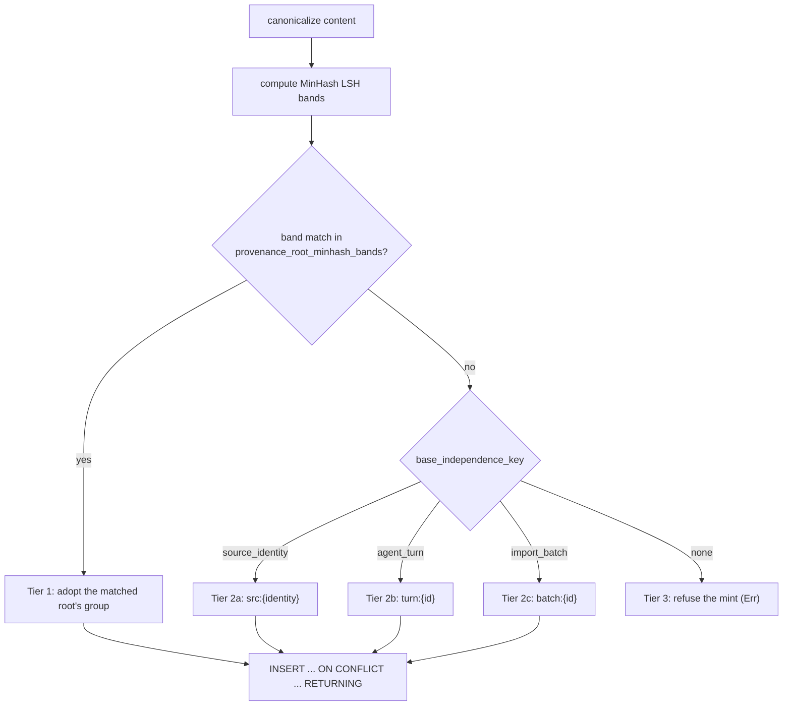

# M6 Stage-0 artifact 3 — independence-group assignment, liveness, and unknown→review policy

Branch `kg-m6-stage0`, cut from `origin/main` at `e39048c7` (release 0.15.2, post-M5-refactor `a028199f`). Every `file:line` below was read on this branch and re-verified after writing.

**Sources.** Frozen goal prompt D1 (relaxed independence-group floor), plus the Q6-locked recipe the code already implements. Companion artifacts: artifact 1 (`docs/plans/2026-08-01-m6-signal-matrix.md`) for the floors this grouping feeds, artifact 2 (`docs/plans/2026-08-01-m6-state-machines.md`) for the coverage-epoch machine referenced in §6.

**Status.** Contract only. **M6 does not assign independence groups** — it counts them. Every assignment mechanism described here is existing M2/M3g/M5 behavior; this artifact pins down what M6 may rely on, what it may not, and where the contract asks for something the tree does not yet produce.

---

## 1. The one-sentence version

A provenance root's `independence_group_id` is assigned once, at mint time, by `acquire_provenance_root`, using a three-tier precedence: **near-dup content overlay wins; else a structural source key; else the mint is refused.** The column is `NOT NULL`, so a root that exists always has a group, and there is no "unassigned" state for M6 to read.

---

## 2. How a root gets its `independence_group_id` today

The seam is `MemoryDB::acquire_provenance_root` (`crates/wenlan-core/src/db.rs:18473`), whose contract is documented at `:18444`–`:18472`. Resolution happens **before** the insert, unconditionally, and is discarded on the conflict branch so an existing root's group is never rewritten (`crates/wenlan-core/src/db.rs:18461`–`:18463`).

| Tier | Rule | Location | Live in production? |
|---|---|---|---|
| 1 | LSH band match adopts an existing near-dup group | `crates/wenlan-core/src/db.rs:18507`–`:18511` | **yes** |
| 2a | `src:{source_identity}` | `crates/wenlan-core/src/provenance.rs:173`–`:174` | **yes** — both production callers always supply it |
| 2b | `turn:{agent_turn}` | `crates/wenlan-core/src/provenance.rs:175` | **no** — see §7.1 |
| 2c | `batch:{import_batch}` | `crates/wenlan-core/src/provenance.rs:176` | **no** — see §7.1 |
| 3 | refuse, route to human review | `crates/wenlan-core/src/db.rs:18521`–`:18528` | **no** — unreachable, see §5 |

**Tier 1 outranks tier 2 on purpose.** The comment at `crates/wenlan-core/src/db.rs:18502`–`:18506` states why: a near-dup catches groups the structural key would keep apart, such as two distinct import batches carrying byte-similar content. The consequence that matters for M6's floor is stated even more directly in the human-root rule (`crates/wenlan-core/src/db/claim_identity.rs:40`–`:43`): a delta a human copied out of a document **adopts that document's group**, so the copy does not become a second independent voice for what the document already said.

**Canonicalization and the near-dup parameters.** Content is NFC-normalized with line endings unified and whitespace collapsed (`canonicalize_content`, `crates/wenlan-core/src/provenance.rs:50`). Near-dup detection uses 8-character shingles — deliberately wider than the entity-name trigram default, because a k=3 shingle set over a whole document is dominated by common substrings (`CONTENT_SHINGLE_K`, `crates/wenlan-core/src/provenance.rs:43`) — and the Jaccard threshold is reused verbatim from `retrieval::dedup` as "near-identical only, never topical" (`CONTENT_NEAR_DUP_THRESHOLD`, `crates/wenlan-core/src/provenance.rs:135`).

**Atomicity.** The root row and its MinHash bands commit in one transaction (`crates/wenlan-core/src/db.rs:18497`, rationale at `:18484`–`:18496`): a root durable without its bands would be permanently invisible to later near-dup lookup, so every later near-dup would mint a separate group forever — a silent, unbounded inflation of the independence count. Only the winning root's bands are indexed (`crates/wenlan-core/src/db.rs:18565`). The comment also records the assumption this rests on: convergence holds **because the daemon is single-writer**; a genuinely concurrent multi-connection deployment reintroduces the race (`crates/wenlan-core/src/db.rs:18495`–`:18496`).

**One known ceiling, and it errs the safe way.** The band match is not re-verified with an exact Jaccard pass, because `provenance_roots` stores only a digest and there is nothing to re-fetch (`crates/wenlan-core/src/db.rs:18465`–`:18472`). So a band collision can merge two genuinely independent roots into one group. That direction is the safe one: a false merge **under-counts** independence and can only make a floor harder to clear, never easier. The dangerous direction — a false *split*, which would inflate the count — requires the band lookup to miss a true near-dup, which the atomicity guarantee above is what prevents.

**Decision S0-19 — M6 relies on the group assignment as-is and adds no re-verification.** The band-only ceiling biases toward under-counting, which is the direction the floor can tolerate: an under-counted candidate simply waits in the frontier. Adding exact-Jaccard re-verification would require storing canonical content, and M6 is the wrong milestone to grow the provenance substrate. If a real corpus later shows false merges suppressing legitimate genesis, the fix belongs in M2's module, not behind an M6 flag.

---

## 3. Liveness matrix

Which roots and groups count toward a D2 floor. Every column here is a real column on this branch.

| Dimension | Values | Location | Counts toward a floor? |
|---|---|---|---|
| `provenance_roots.status` | `ingesting` | `crates/wenlan-core/src/db.rs:8789` | **no** — not yet finalized |
| | `active` (default) | | **yes** |
| | `failed` | | **no** |
| `provenance_roots.root_kind` | `document_ingest` | `crates/wenlan-core/src/db.rs:8787` | **yes** — external |
| | `human_capture` | | **yes** per D1 R1 — but never minted, §7.2 |
| | `human_edit_delta` | | **yes** per D1 R1, subject to the one-group rule (§4) |
| | `generated` | | **no** — D1 R2. Never minted either, §7.2 |
| `edges.grounded` | `1` | `crates/wenlan-core/src/db.rs:8807` | **yes** |
| | `0` | | **no** — extraction proposes, only the validator grounds |
| `edges.valid_until` | `NULL` | `crates/wenlan-core/src/db.rs:8816` | **yes** — "`valid_until IS NULL` is the assertion that it is still true" (`crates/wenlan-core/src/db/claim_identity.rs:364`–`:365`) |
| | set | | **no** — retracted |
| `edges.root_id` | non-NULL | `crates/wenlan-core/src/db.rs:8808` | **yes** |
| | NULL | | **no** — but see S0-20 |

The conjunction is exactly the partial index `idx_edges_active_grounded_space_type ... WHERE valid_until IS NULL AND grounded = 1` (`crates/wenlan-core/src/db.rs:8823`–`:8824`), so the hot half of the predicate is already indexed.

**Root kind is immutable.** A trigger refuses any update to `root_kind` (`provenance_roots_kind_is_immutable`, `crates/wenlan-core/src/db/claim_identity.rs:459`–`:463`), because the kind is part of the root's own content address. So D1 R2's exclusion of generated roots cannot be defeated by relabelling a root after the fact.

**Group liveness is derived, not stored.** There is no group table — `independence_group_id` is a bare `TEXT NOT NULL` column on `provenance_roots` (`crates/wenlan-core/src/db.rs:8788`), and a group exists exactly as long as some root carries its value. A group is **live for counting** when at least one of its roots satisfies the whole conjunction above. Nothing needs to reap a group whose roots all retract; it simply stops appearing in the count.

**Decision S0-20 — an edge with `grounded = 1 AND root_id IS NULL` is surfaced, never silently dropped.** The `root_id` column is nullable and the count expression joins through it, so such a row contributes zero while looking, to any casual reader, like live grounded evidence. The M3g promoter always mints a root before flipping `grounded` (`crates/wenlan-core/src/edge_grounding.rs:537` then the flip), so this should be empty — but "should be empty" is exactly the condition worth asserting. D7 forbids silently parking evidence, so PR-A's frontier reconciliation counts these rows and surfaces a non-zero count as a data-quality signal rather than letting an INNER JOIN swallow them.

---

## 4. Collapse rules

D1: *"Chunks, mirrors, and same-session captures collapse through the independence group."* Each collapse, its enforcing mechanism, and its evidence.

| Collapse | Enforcing mechanism | Evidence on this branch | Verdict |
|---|---|---|---|
| **chunk → document** | every chunk of one file carries the same `source_identity` (the source memory's url-or-source_id, `crates/wenlan-core/src/edge_grounding.rs:519`–`:531`), so all chunks resolve to the same `src:` key | asserted by test: *"distinct chunks of one file share one independence_group_id"* (`crates/wenlan-core/src/edge_grounding.rs:2251`) | `EXISTS` |
| **mirror → group** | tier 1: a byte-similar copy hits the same LSH bands and adopts the original's group, even across distinct import batches | `crates/wenlan-core/src/db.rs:18502`–`:18511` | `EXISTS` |
| **same-session capture → group** | contract intent is tier 2b (`turn:{agent_turn}`). In the tree, human authorship collapses harder: **all** human-authored roots share one group | `HUMAN_SOURCE_IDENTITY = "human:local"` (`crates/wenlan-core/src/db/claim_identity.rs:44`), used at `:689`; asserted by `every_human_delta_shares_one_independence_group` (`crates/wenlan-core/src/db/claim_identity_test.rs:599`) | `EXISTS`, by a stronger rule — see below |
| **human edit copied from a document → that document's group** | tier 1 outranks the human key | `crates/wenlan-core/src/db/claim_identity.rs:40`–`:43` | `EXISTS` |

**The human-authorship rule is stronger than D1 asks, and deliberately so.** D1 asks same-*session* captures to collapse; the tree collapses all human authorship, across sessions and across pages, into one group. The reasoning is recorded at `crates/wenlan-core/src/db/claim_identity.rs:26`–`:38` and names M6 explicitly:

> Independence groups exist to count *independent* corroboration (M6's support floor). One person writing the same thing on two pages, or in two sessions, is one source and not two — so collapsing all human authorship into a single group is the honest reading, and it is also the conservative one: this can only ever under-count independence, never inflate it, which is the failure Q6 B.4 refuses to risk.

**Decision S0-21 — M6 adopts the stronger rule and does not weaken it to per-session.** *(Status: confirmed by the team lead 2026-08-01 as the recommended reading; pending the user/Sol veto window.)* Implementing D1's literal "same-session" collapse would require splitting `human:local` into per-session keys, which would let one author supply multiple groups by working across sessions — precisely the inflation the existing rule refuses. The contract's floor is a floor on *independent* corroboration, and the stronger rule serves that intent better than its own wording. This is a deliberate divergence from the literal text of D1, flagged for veto.

The direct consequence, which artifact 1 records as boundary case B28: **three human-authored deltas are one group, not three, and can never clear a 3-group floor by themselves.** Any test that seeds three human deltas and expects admission is asserting a bug.

---

## 5. Unknown independence, and the review policy

### 5.1 What "unknown independence" concretely is

Q6 B.4 says un-establishable independence routes to human review and never to auto-genesis. In the code that is the `None` arm of `base_independence_key` (`crates/wenlan-core/src/provenance.rs:171`–`:177`), reached when a root has no near-dup match **and** no `source_identity`, `agent_turn`, or `import_batch`. `acquire_provenance_root` then returns an error rather than minting a random group, with the reasoning inline at `crates/wenlan-core/src/db.rs:18515`–`:18528`: minting a fresh UUID group *"would silently manufacture a distinct independence group and inflate independent-support counts"*.

### 5.2 On this branch the branch is unreachable

There are exactly two production callers of `acquire_provenance_root`, and both always pass `source_identity: Some(...)`:

| Caller | Kind | `source_identity` | `agent_turn` / `import_batch` |
|---|---|---|---|
| `crates/wenlan-core/src/edge_grounding.rs:537` | `document_ingest` | the source memory's url-or-source_id (`:531`) | `None`, `None` (`:532`–`:533`) |
| `crates/wenlan-core/src/db/claim_identity.rs:694` | `human_edit_delta` | `HUMAN_SOURCE_IDENTITY` (`:689`) | `None`, `None` (`:690`–`:691`) |

So tier 3 cannot fire. The document lane additionally guards *before* the call: an edge whose memory has no `source_identity` is skipped with a `log::warn!`, the cursor advances, and the edge is retried on a later tick (`crates/wenlan-core/src/edge_grounding.rs:519`–`:529`). Its comment calls this "unreachable for folder memories (`source_id NOT NULL`), guarded defensively."

**That guard is fail-closed and safe, but it is not a review route.** It produces a log line and no durable artifact. Nothing records that a human owes a decision, and nothing surfaces the skipped edge. If the guard ever does fire, the evidence is neither counted nor visible.

### 5.3 What M6 actually reads, and why the read side has no unknown state

This is the part that keeps the policy simple. **M6 counts roots; it never mints them.** `independence_group_id` is `TEXT NOT NULL` (`crates/wenlan-core/src/db.rs:8788`), so every root that exists has a group. From M6's read side there is no unknown-independence root to route — the assignment either succeeded (a row exists, with a group) or the root was never created (nothing to count, nothing to see).

Therefore:

**Decision S0-22 — "unknown independence" is a write-side condition M6 observes only as absent evidence, and M6's obligation is to surface the absence, not to classify it.** M6 must not add a fourth tier, a placeholder group, or an "unknown" sentinel value; all three would put a row into the count that the write side deliberately refused to create. M6's obligation under D7 ("never lose or silently park evidence") is discharged by S0-20's surfacing of edges that look grounded but carry no root, plus the unformed-topic card for groups that persistently sit below the floor.

**Decision S0-23 — the durable review artifact for a refused mint is `PR-A-new`, and it belongs to the write side.** D1 R4 asks for a review route. The tree has a refusal with no durable record (§5.2). PR-A adds a durable row when a mint is refused or an edge is skipped for a missing source identity, carrying the edge ID, the reason, and a timestamp, so the frontier can surface it as a card. It is named here rather than designed here because the writer is `edge_grounding` and `acquire_provenance_root`, both outside M6's write surface — M6 consumes the card, it does not produce it. If the reviewer prefers to leave the log-only behavior in place, the consequence to accept is that D1 R4 is aspirational on this branch, which artifact 1 §5 already records as "partial".

---

## 6. Interaction with coverage epochs

Machine D in artifact 2 (`docs/plans/2026-08-01-m6-state-machines.md`, §7) makes `coverage_epoch` a per-space, monotone integer, and machine B keys every claim by `(root_id, coverage_epoch)` and `(independence_group_id, coverage_epoch)`.

Independence groups and coverage epochs are **independent axes**, and keeping them independent is what makes both machines simple:

| Event | Effect on `independence_group_id` | Effect on coverage |
|---|---|---|
| a new near-dup root is minted and adopts an existing group | none — the group's identity is unchanged | none. D5: routine recomputation or root/mirror lifecycle does not reset successful group coverage |
| every root in a covered group is retracted | the group stops appearing in the live count | **none** — coverage is permanent. The page already exists and its genesis provenance is durable (D14) |
| a group first appears (a genuinely new source) | a new `independence_group_id` value | if the group mirrors an already-covered group, it is covered immediately (machine F, F10); otherwise it enters the waiting frontier |
| a contract-version epoch opens for a space | none — group IDs are not epoch-scoped | every prior permanent coverage row must be mapped forward before new-epoch genesis is enabled (machine D, D3) |

**Decision S0-24 — `independence_group_id` values are never rewritten by an epoch transition; the epoch migration maps coverage rows, not group identities.** A group ID is derived from content and source signals, neither of which an M6 contract version can change. Rewriting group IDs at an epoch boundary would break the content-addressed convergence property that `acquire_provenance_root` depends on — two byte-identical imports on either side of the boundary would stop converging. So machine D's forward mapping rewrites the coverage rows' `coverage_epoch`, leaving `genesis_candidate_roots.independence_group_id` and `provenance_roots.independence_group_id` untouched.

**Decision S0-25 — a group whose roots have all retracted stays covered and does not return to the frontier.** D5 is explicit that root lifecycle does not reset successful coverage, and D14 forbids discarding genesis provenance. The alternative — returning a group to the frontier when its evidence dies — would re-mint a page for a topic whose sources are gone. The published page remains subject to the normal M5 support and refresh machinery, which is where evidence loss should show up (as support dropping), not in genesis.

---

## 7. Findings

Reported, not resolved.

### 7.1 Two of the three structural independence tiers are dead in production

`base_independence_key` implements a three-way precedence — `source_identity`, then `agent_turn`, then `import_batch` (`crates/wenlan-core/src/provenance.rs:171`–`:177`) — but every production construction of `IndependenceSignals` sets the latter two to `None` (`crates/wenlan-core/src/edge_grounding.rs:532`–`:533`; `crates/wenlan-core/src/db/claim_identity.rs:690`–`:691`). The only code that exercises tiers 2b and 2c is the unit test at `crates/wenlan-core/src/provenance.rs:289` and `:299`.

`import_batch` exists as a concept elsewhere — the importer stamps an `"import_batch"` metadata key (`crates/wenlan-core/src/importer.rs:416` and `:681`) — but it is never threaded into `IndependenceSignals`.

**Why this is not a defect today.** Both live lanes have a genuine per-item source identity, which is the *highest*-precedence signal, so the fallbacks are correctly unused. The tiers are there for lanes that do not exist yet.

**Why it matters for M6.** D1 R3's "same-session captures collapse through the independence group" names a mechanism whose implementation tier is dead. In the tree the collapse happens anyway, and harder, through the human-root rule (§4) — so the *outcome* D1 wants holds. But an implementer reading D1 and grepping for `agent_turn` will find a dead path and may wire it up, which would **split** human authorship per session and inflate the count. Decision S0-21 is the guardrail; G2's B28 boundary case is its test.

### 7.2 Two of the four root kinds are never minted

The `root_kind` CHECK enumerates four values (`crates/wenlan-core/src/db.rs:8787`), but production mints only `document_ingest` (`crates/wenlan-core/src/edge_grounding.rs:537`) and `human_edit_delta` (`crates/wenlan-core/src/db/claim_identity.rs:694`). No production path mints `human_capture` or `generated`.

Consequences, in opposite directions:

- **`generated`** — D1 R2 ("generated roots count zero") is currently a filter over an empty set. Harmless and correct to keep: it costs one predicate and it is the difference between "no generated roots exist" and "generated roots cannot vote". Keep it.
- **`human_capture`** — D1 R1 says "UI-authorized human capture/correction groups count". No production path produces such a root, so that half of R1 contributes nothing today. Combined with §4's one-group rule, the practical position is that **human input contributes at most one independence group in total**, regardless of how much a person captures. That may be exactly right, or it may mean the UI-authorized capture lane is a milestone that has not landed. I cannot tell from this branch which.

### 7.3 Convergence rests on the single-writer assumption

`acquire_provenance_root`'s comment states that near-dup convergence holds because the daemon is single-writer, and that a concurrent multi-connection deployment would reintroduce the race (`crates/wenlan-core/src/db.rs:18495`–`:18496`). That assumption is true today — the repo's own architecture rule is that only `wenlan-server` opens the database. Recording it here because M6 adds four new lease phases and therefore new concurrent-looking work, and a future reader could reasonably wonder whether that changes the picture. It does not: the phases serialize on one connection, and artifact 2's lease registry is what keeps them from overlapping. But if the daemon ever gains a second writer connection, independence grouping is one of the things that breaks silently, and the failure mode is group *splitting* — the inflating direction.

---

## 8. Relationship to the gates

- **G2 `m6_genesis_counts_groups_not_rows`** is the primary consumer. §3's liveness matrix supplies its negative cases (inactive, ungrounded, retracted, generated); §4's collapse rules supply the chunk, mirror, and same-session cases; §4's human-authorship rule supplies boundary case B28 in artifact 1 §6, which is the subtlest one and the most likely to be written backwards.
- **G1 `m6_prerequisites_are_durable`** should assert what §7 reports: that the substrate M6 counts is not merely present but produced. A prerequisite check that confirms `provenance_roots` exists, without confirming that something mints rows into it, would pass on an empty database.
- **G5 `m6_frontier_has_no_missing_root`** consumes S0-20: an edge that looks grounded but carries no root is evidence the count cannot see, and G5's differential query is where that has to surface rather than vanish into a join.
