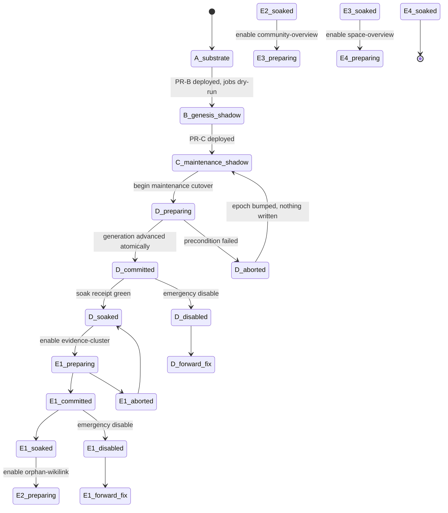

# M6 Stage-0 artifact 11 — per-space readiness, cutover, soak, rollback, backup, restore

Status: Stage-0 contract artifact. Normative for PR-A onward.
Scope: frozen contract D14, the Rollback section, and gate G11
(`m6_signal_cutover_is_independent`). Touches G1's prerequisite handshake.
Continues the decision numbering from artifact 10 (`S0-118`).

**Revision log.** Rev 2 answers review findings 4, 5, 6, 14 and 16. S0-119's key
gains a non-null sentinel (finding 5); precondition 1 is restored to the frozen
100% and made checkable by S0-153 (finding 4); S0-126 gains a concrete minimum
window (finding 14); S0-129 gains its third condition (finding 6); S0-131's
ledger-class count is reconciled (finding 16). No S0 number was reused or
renumbered.

### Citation conventions

In-repo citations are read on branch `kg-m6-stage0`. Three files carry almost
all of them, and a short-form `basename:NNN` below always means one of these:

- `crates/wenlan-core/src/db.rs`
- `crates/wenlan-core/src/db/truth_exposure.rs`
- `crates/wenlan-core/src/post_write/page_update.rs`

A bare `:NNN` continues the file named most recently in the same passage.

Citations written **`gp@wenlan-app:NNN`** are foreign: they refer to line NNN of
the frozen M6 contract,
`docs/superpowers/plans/2026-07-27-kg-m6-goal-prompt.md` in the `wenlan-app`
repository. That file is **untracked** — present in a working tree, never
committed to any branch — so a reader cannot obtain it from git. See finding
F5.

The "A/B/C/D/E" of the title are the five daemon stages — PR-A substrate,
PR-B genesis shadow, PR-C maintenance shadow, PR-D maintenance cutover,
PR-E1..E4 serial genesis cutovers. This artifact defines what it means for **one
space** to be at each of them, and what moving between them costs.

---

## 0. The headline: the pattern is proven five times, the axis is new

M6 is not inventing cutover control. The repo already carries five of them, and
all five agree on shape — a durable enable flag, a monotone generation, and a
parity proof that must still be current:

| Mechanism | Where | Keyed by |
|---|---|---|
| `edges_reader_cutover` + `edges_parity_watermark` | `db.rs:9044`-`:9056` (migration 82) | `consumer` |
| `entity_reader_cutover` + `entity_page_parity_watermark` | `db.rs:10327`-`:10334` (migration 94) | `consumer` |
| `community_reader_cutover` + `community_reader_parity` | `db.rs:10895`-`:10902` (migration 96) | `consumer` |
| M5 truth cutover generation | `truth_exposure.rs:39` | **nothing — one global row** |
| M5 truth writer fence | `truth_exposure.rs:43` | **nothing — one global row** |

The M2 gating predicate states the shape most clearly: a consumer flips *iff* it
is enabled **and** the watermark is clean (`drift_count = 0`) **and** the
watermark's `proven_epoch` still equals the current epoch, because that triple is
"what 'no unreconciled older operation remains' means operationally"
(`db.rs:9034`-`:9038`).

**Not one of the five has a space column.** Three are per-consumer and global
across spaces; two are single rows in `app_metadata`. M6 needs per-space **and**
per-signal — a two-dimensional key where every precedent is one-dimensional or
zero-dimensional.

> **Decision S0-119 — M6 adds one readiness table keyed
> `(space, stage, signal)`, and does not extend any of the five existing
> planes.** Widening `community_reader_cutover` with a space column would change
> the meaning of every existing row (a global row is not "all spaces" — it is
> "unkeyed"), and the migration would have to invent a space for rows that never
> had one. A new table starts empty, which is the only starting state that means
> "no space is cut over" without a backfill guessing at intent.
>
> `signal` is **`NOT NULL DEFAULT '-'`**: the literal `'-'` for stages A–D, and
> one of the four genesis signal names for stage E. G11's independence is then a
> key property rather than a checked invariant.

> **Decision S0-152 *(rev 2, finding 5)* — the stage-A–D `signal` is a non-null
> sentinel, never `NULL`.** Rev 1 wrote `NULL`, which silently made the key not a
> key. In SQLite, NULLs are distinct inside a `PRIMARY KEY` or `UNIQUE` on an
> ordinary rowid table, so `('Work','D',NULL)` could be inserted without limit
> and a space could hold any number of contradictory stage-D readiness rows. This
> was checked rather than recalled: on SQLite 3.51.0, two inserts of
> `('Work','D',NULL)` into `PRIMARY KEY (space, stage, signal)` both succeed,
> while with the sentinel the second fails `UNIQUE constraint failed` and four
> distinct stage-E signal rows still coexist. `WITHOUT ROWID` and `STRICT` would
> also have rejected the NULL, but this repository has no table of either kind,
> so a decision resting on that would have rested on a convention the code does
> not follow. The sentinel is `'-'` rather than the empty string so it stays
> visible in query output.

---

## 1. The fence: reuse M5's epoch+phase pair, do not invent a generation integer

M5 already solved the hard part, and the reasoning is on the page:

> *"`off -> preparing -> off` on an abort would let a writer that captured `off`
> before the ceremony compare-and-swap successfully afterwards — a textbook ABA.
> The phase enum cannot distinguish 'the `off` I read' from 'a later `off`', and
> the writer that wins that CAS is exactly the one whose page the ceremony never
> examined. So every transition bumps the epoch, monotonically, and a writer
> swaps the *pair*."* — `truth_exposure.rs:79`-`:89`

`CutoverFence { epoch, phase }` (`:90`-`:94`), `INITIAL` = epoch 0 / phase off
(`:98`-`:101`), `next()` always increments (`:115`-`:120`), and the swap is a
real compare-and-set — `UPDATE app_metadata SET value = ?2 WHERE key = ?1 AND
value = ?3` (`:504`-`:505`) with an insert-if-absent second statement for a
database's first ceremony (`:509`-`:515`).

> **Decision S0-120 — M6's per-space readiness is an `(epoch, phase)` pair per
> key, not a bare generation integer, and every transition bumps the epoch.**
> The ABA hole is not specific to M5's phases. An M6 space that goes
> enabled → disabled (emergency) → enabled reproduces it exactly: a writer that
> captured "enabled, generation 7" before the disable would CAS successfully
> after the re-enable, and it is precisely the writer whose in-flight work the
> disable was meant to strand.

> **Decision S0-121 — an unreadable or unparseable readiness row is an error
> that refuses the write, never a default that permits it.** M5 states the
> asymmetry: *"every other gate in this module fails toward inert, but 'inert'
> for a fence means letting writers through, and an indeterminate fence is
> precisely the state where that is unsafe — recovery consults durable state,
> never a guess"* (`truth_exposure.rs:466`-`:473`). M6 inherits it verbatim.
> Fail-closed here means *refuse*, and "fail-closed" is ambiguous enough in
> review that the direction has to be written down.

### 1.1 One phase enum, and one one-way door

M5's `CutoverPhase` is `Off | Preparing | Committed` (`truth_exposure.rs:51`-`:56`),
and `Committed` **never returns to `Off`** — because rebuilding the full legacy
projection directory *"is exactly the flip the rollback contract forbids — every
provisional page's prose would reappear at a path `wenlan pages` reads directly,
with nothing able to stop it"* (`:47`-`:50`).

> **Decision S0-122 — M6 reuses the three-phase shape and inherits the one-way
> door, per space.** `off → preparing → committed`, and a committed space never
> returns to off. Disabling a committed space stops automation and leaves state
> in place (§5); it does not rewind the phase. This is the operational form of
> D14's "rollback cannot expose M5-provisional prose" and of the frozen
> Rollback section's "never … expose provisional prose."

---

## 2. The per-space stage machine



Two properties of this diagram are contract, not drawing:

**Abort returns to the previous *soaked* state, never to `off`-as-if-nothing-
happened.** The epoch still bumps on abort (S0-120), so a writer holding a
pre-abort capture cannot win a later CAS.

**A disabled committed stage goes to forward-fix, not back up the chain.** D14:
*"Otherwise stop automation and forward-fix; never silently resume the old
writer"* (`gp@wenlan-app:422`).

> **Decision S0-123 — the four E-stages are strictly serial per space, and the
> serialization is enforced by a precondition on the readiness row, not by
> operator discipline.** Enabling E2 requires E1's row to be `committed` **and**
> soaked. The frozen contract already says a later signal cannot compensate for
> an earlier one's failed gate; making that a checked precondition is what turns
> it from a process promise into a gate.

> **Decision S0-124 — E-stage rollback is per-signal and does not touch its
> predecessors.** Disabling E2 leaves E1 committed and running. G11 states this
> as "a failed later signal does not roll back a healthy earlier one"; keying
> readiness by `(space, stage, signal)` makes it structural.

---

## 3. The PR-D precondition set, as checkable predicates

The frozen contract lists six PR-D steps (`gp@wenlan-app:509`-`:515`). Step 3 —
*"verify M5 truth readiness, M6 reader/writer manifests, relevance parity,
dependency state, app availability, and zero pending incompatible jobs"* — is
six separate checks, and each needs a definition or it will be discharged by
inspection.

| # | Precondition | Checkable form |
|---|---|---|
| 1 | M5 truth readiness at **100%** (G1's word, `gp@wenlan-app:537`) | truth cutover phase is `committed` **and** the space's evaluation census is complete — see S0-153 (and F1 on why this stays read-only) |
| 2 | M6 reader manifest | the D12 manifest's structural CI test is green on the deployed commit |
| 3 | M6 writer manifest | same test, writer half; every listed caller has its fence adapter |
| 4 | relevance parity | incremental pair state equals full recomputation for this space (artifact 6 §5 oracle) |
| 5 | dependency state | zero rows in the refresh dependency table for this space referencing a retracted or absent root |
| 6 | app availability | the app's compatibility manifest advertises a contract version this daemon supports (G1) |
| 7 | zero pending incompatible jobs | zero rows in the genesis/refresh job tables for this space at a schema older than the current readiness epoch |

> **Decision S0-153 *(rev 2, finding 4)* — "M5 readiness/cutover at 100%" is a
> census over `page_truth_state`, and nothing the daemon reports about itself can
> stand in for it.** Rev 1 weakened G1's *100%* to "at least one supported page",
> which G1 rejects on its face — the gate says 100%, and a gate that passes at 99%
> is not that gate. The frozen wording is restored, and 100% is checkable because
> M5 already recorded the distinction the census needs:
>
> ```sql
> -- all three must return zero for the space
> -- (a) pages with no truth row, or a row judged against a stale version
> SELECT count(*) FROM pages p
>   LEFT JOIN page_truth_state t ON t.page_id = p.id
>  WHERE p.space = ?1 AND (t.page_id IS NULL OR t.page_version <> p.version);
> -- (b) pages never actually judged
> SELECT count(*) FROM pages p JOIN page_truth_state t ON t.page_id = p.id
>  WHERE p.space = ?1 AND t.evaluated_at IS NULL;
> -- (c) derivation work still owed or abandoned
> SELECT count(*) FROM claim_derivation_jobs j JOIN pages p ON p.id = j.page_id
>  WHERE p.space = ?1 AND j.status IN ('pending','leased','parked');
> ```
>
> Clause (b) is the one that carries the weight, and it is available only because
> M5 anticipated exactly this: `evaluated_at` is *"When a judgement last ran, or
> NULL if none ever has"*, and *"migration 99 leaves this NULL for every
> backfilled page, which is what keeps a cutover from archiving a whole vault on
> day one"* (`crates/wenlan-core/src/db/claim_identity.rs:285`-`:291`). Without
> (b), a freshly-migrated vault reads as fully decided when in truth nothing has
> been looked at. Clause (c) counts `parked` as incomplete because a parked job is
> a page the pipeline gave up on, which is the definition of not-100%.
>
> **What cannot prove it.** `GET /api/status` cannot, and no daemon handshake
> resting on it can. Its response carries `is_running`, `files_indexed`, two queue
> depths, reranker and inference state, and a capability list
> (`crates/wenlan-server/src/routes.rs:149`-`:160`) — **no space dimension at
> all** — and its `queue` field is the document-enrichment queue, not
> `claim_derivation_jobs`. It is also error-swallowing by construction:
> `db.count().await.unwrap_or(0)` (`:128`) and `Ok(0) | Err(_) =>
> QueueStatus::Idle` (`:135`) each report *healthier* than reality when the
> underlying query fails, so an all-clear from it is indistinguishable from a
> broken query. What suffices is the three counting queries above, run inside the
> advancing transaction per S0-125, with their results written into the readiness
> row — a claim re-derivable from durable rows afterwards, rather than a status a
> process asserted about itself.

> **Decision S0-125 — every precondition is evaluated inside the same
> transaction that advances the readiness epoch, against durable state.** A
> precondition checked before the transaction is a precondition that can go
> false between the check and the advance, which is the same race the M5 fence
> CAS exists to close. Checks 2, 3, and 6 are properties of the *deployment*
> rather than the database; those are recorded as a signed row written by the
> deploy step and read inside the transaction, so the transaction still reads
> durable state rather than calling out.

---

## 4. Soak

The frozen contract requires a soak between every cutover and the next
(`gp@wenlan-app:515`, `:529`), and "do not enable genesis during maintenance
soak" (`gp@wenlan-app:517`), but never defines when a soak has passed.

> **Decision S0-126 — a soak passes on a receipt with three independent
> components, and elapsed time alone is never one of them.**
>
> 1. **A continuous old-writer mutation check** over the whole soak window: zero
>    mutations to pages in this space from any caller outside the D12 manifest.
>    This is the check the frozen contract names explicitly for PR-D (`gp@wenlan-app:515`).
> 2. **A work-bound observation**: the per-turn caps and query budgets from
>    artifacts 5 and 6 were not exceeded on any turn in the window.
> 3. **A no-regression observation**: no page in this space moved from
>    `supported` to `provisional` as a consequence of M6 work.
>
> A minimum window is a necessary condition, not a sufficient one — a space with
> no activity during the window has proven nothing.
>
> **The minimum, concretely (rev 2, finding 14): 72 hours of wall clock, at least
> 20 observed M6 turns in this space, and at least one daemon start inside the
> window.** Rev 1 said "a minimum window" and named no number, which carries the
> same defect as an operator-attested soak: nothing can fail it. 72 hours spans
> three daily cycles, so a once-a-day ingestion pattern is seen more than once and
> a weekday boundary cannot hide inside the window. Twenty turns is the smallest
> count at which the per-turn caps of artifacts 5 and 6 have been exercised often
> enough for component 2 to mean anything. The daemon-start clause is there
> because every crash-recovery edge in artifact 2 — A7, and machine C's lease
> expiry — runs only on startup, so a soak with no restart has never observed the
> recovery half; an operator who reaches 72 hours without one satisfies it by
> restarting deliberately, which is seconds of work rather than a stall.

> **Decision S0-127 — the soak receipt is durable, per `(space, stage, signal)`,
> and is a precondition of the next stage's transaction (S0-125).** An
> operator-attested soak is the exact shape of evidence the frozen contract
> rejects elsewhere ("a current daemon claiming that old binaries refuse is not
> evidence", G1).

---

## 5. Rollback, per stage

Transcribing the frozen Rollback section (`gp@wenlan-app:719`-`:733`) into per-stage
obligations, with the D14 constraints (`gp@wenlan-app:407`-`:422`) applied:

| Stage | On rollback |
|---|---|
| **A** | jobs already disabled; keep the additive substrate. Restore only via the verified pre-migration backup and only with no later human edit (§7). |
| **B / C** | stop jobs, invalidate leases, **retain** frontier/coverage/statistics for diagnosis, readers and writers unchanged. |
| **App** | retain old-daemon/partial-space fallback; disable M6 actions (artifact 10 §6). |
| **D** | disable the maintenance generation for that space, drain leases, and return automatic calls to the prior writer **only** before the first M6 mutation in that space, or after a tested reverse ledger (§6). Otherwise stop automation and forward-fix. |
| **E** | disable the affected signal, invalidate its leases. Machine-owned unchanged genesis pages may be archived; human-edited or depended-on pages stay readable with automation disabled. |

Three invariants cut across all five (`gp@wenlan-app:735`-`:736`): never restore across later
human edits, never discard human decisions / history / receipts / suppressions,
never expose provisional prose.

> **Decision S0-128 — "before the first M6 mutation for that space" is a durable
> counter, not an inference from an empty result set.** The reverse-ledger
> escape hatch in D14 hinges entirely on this predicate, and deriving it by
> querying for M6-written rows is unsound: a row that was written and then
> deleted leaves no trace, and that is exactly the state where resuming the old
> writer is unsafe. PR-A adds a monotone per-space M6-mutation counter,
> incremented in the same transaction as any M6 write, and "no M6 mutation yet"
> means the counter is zero — never "the query found nothing."

> **Decision S0-129 — archiving a genesis page requires machine ownership AND
> byte-and-version equality with genesis AND no durable human dependency, all
> three checked at archive time.** Ownership is `page_is_human_owned`
> (`post_write/page_update.rs:111`-`:113`: `page.user_edited ||
> page.creation_kind == "authored"`), and the byte/version half needs the
> genesis-provenance row PR-A creates.
>
> **The third condition (rev 2, finding 6).** Rev 1's own rationale said "a
> machine-owned page can still have been *depended on* by a human decision, and
> D14 keeps depended-on pages readable" — and then required only two conditions,
> leaving the hazard it had just named unguarded. The guard is four zero-count
> checks over substrate that mostly exists already:
>
> | # | A durable human dependency exists if… | Where |
> |---|---|---|
> | 1 | the page's truth state was reviewed by a human | `page_truth_state.human_reviewed = 1` (`crates/wenlan-core/src/db/claim_identity.rs:292`-`:299`) |
> | 2 | a human-owned page links to it | `page_links.target_page_id` = this page, joined to a source page satisfying `page_is_human_owned` (`crates/wenlan-core/src/db.rs:6666`-`:6675`) |
> | 3 | a human dismissed or suppressed something naming it | the durable suppression identity of artifact 2's F7, which D14 preserves across rollback |
> | 4 | a presence-authorized M6 action names it | an M5 receipt whose allowlisted `slot_id` or `page_id` is this page (artifact 10 §7.1) |
>
> Any one of the four blocks the archive; the page stays readable and the reverse
> ledger records it as retained-with-reason. Checks 1 and 2 are ordinary SQL over
> tables that ship today. Checks 3 and 4 become evaluable when PR-A lands their
> rows and are vacuously zero until then — safe only because 1 and 2 are not
> vacuous, which is the condition PR-A must not quietly break.

---

## 6. The reverse ledger is not a snapshot restore

This is the structural point of the whole artifact, and it falls straight out of
what the backup primitive actually is.

`online_backup` (`db.rs:17559`) takes a **whole-database physical byte copy**:
it folds the WAL back with `PRAGMA wal_checkpoint(TRUNCATE)` under the connection
mutex, then copies the main database file, because *"a byte copy (unlike `VACUUM
INTO`) preserves the libSQL DiskANN vector-index shadow tables exactly; VACUUM
reorders their rows and the snapshot then fails `PRAGMA integrity_check`"*
(`:17546`-`:17555`).

A whole-database copy can only be restored whole. So:

> **Decision S0-130 — snapshot restore is legal only when no human edit has
> landed since the snapshot; every other recovery is a reverse ledger.**
> D14's "never restore a snapshot over later human edits" is not a caution to be
> careful — with a whole-file snapshot it is a hard structural limit, because
> there is no partial restore that could preserve the later edit. Once any human
> edit post-dates the snapshot, the snapshot is diagnostic material only.

> **Decision S0-131 — the reverse ledger enumerates the sixteen row classes D14
> names, and a ledger missing any class does not qualify.** D14
> (`gp@wenlan-app:418`-`:421`) requires "exact compatibility for every M6
> genesis/page version, claim/support/truth/history/card row, attachment,
> dependency, candidate, frontier, coverage, suppression, subscription,
> genesis-provenance, receipt, and later human edit". Written as prose that is
> twelve comma-separated phrases, two of which are slash-compounds; expanded, it
> is sixteen row classes:
>
> | # | Class | | # | Class |
> |---|---|---|---|---|
> | 1 | M6 genesis page version | | 9 | candidate |
> | 2 | claim | | 10 | frontier |
> | 3 | support | | 11 | coverage |
> | 4 | truth | | 12 | suppression |
> | 5 | history | | 13 | subscription |
> | 6 | card | | 14 | genesis-provenance |
> | 7 | attachment | | 15 | receipt |
> | 8 | dependency | | 16 | later human edit |
>
> *(rev 2, finding 16: rev 1 wrote "thirteen" above a list that already had
> sixteen entries. The list was right and the count was wrong, so the count is
> what changed — no class was added or removed. The table replaces the run-on
> sentence precisely so the next reader can check the count without parsing
> slashes.)*
>
> The list is the test: PR-D's reverse-ledger test asserts one case per class, and
> a class with no case is a failing gate, not an omission.

---

## 7. Backup — mostly already built, with three gaps

PR-A requires *"pre-migration online backup, integrity receipt, and restore
drill"* (`gp@wenlan-app:466`). All three exist:

- `backup_before_migration` (`db.rs:8968`) snapshots before a migration's DDL,
  fails the migration if the snapshot fails `integrity_check`
  (`:8999`-`:9003`), and records the receipt in `app_metadata` under
  `backup_before_migration_<n>` (`:9006`-`:9010`).
- It skips a fresh database (`prior_version == 0`, `:8973`-`:8975`).
- It **preserves the original restore point across retries**: a pre-existing
  destination can only come from an earlier failed attempt at the same
  migration, and re-snapshotting *"would have `online_backup` delete that
  pristine file and copy the now-partially-migrated live DB over it — destroying
  the very pre-migration state this backup exists to provide"* (`:8984`-`:8989`).
- Twelve migrations already call it — 82, 89, 90, 91, 92, 93, 94, 95, 96, 97,
  98, 99 (`db.rs:9068`, `:9133`, `:9403`, `:9459`, `:9797`, `:10155`, `:10352`,
  `:10389`, `:10801`, `:11645`, `:11678`, `:11745`).
- The restore drill is executed rather than promised
  (`crates/wenlan-core/src/db/main_tests.rs:42250`,
  `crates/wenlan-core/src/db/edges_rebuild_test.rs:717`-`:718`).

> **Decision S0-132 — every M6 migration that is not purely additive calls
> `backup_before_migration`, and PR-A's migration test asserts the receipt key
> exists afterward.** The primitive is proven; the obligation is to use it.
> Purely additive `CREATE TABLE IF NOT EXISTS` migrations may skip it, matching
> the existing pattern — migration 82's own note that it is *"pure `CREATE TABLE
> IF NOT EXISTS` inside one BEGIN/COMMIT, no backfill, no data mutation —
> kill/rerun converges trivially"* (`db.rs:9040`-`:9041`) is the standard.

The three gaps are in §8 findings F2, F3, and F4.

---

## 8. Older daemons must refuse — already live, but the evidence form is not

PR-A: *"Older daemons must refuse the new schema."* This is implemented and
load-bearing. `run_migrations` refuses to open a database stamped newer than the
build supports (`db.rs:3658`-`:3664`), with the reasoning that every migration is
gated `if version < N`, so a newer `user_version` *"silently skips all of them
and we would go on writing against a schema we cannot see"*, and — the part that
makes it real — *"this is not hypothetical: an older installed build can still be
running and reopening the same file every few seconds"* (`:3650`-`:3657`).
`SCHEMA_VERSION` is `103` (`db.rs:682`). The repair path has its own equality
check (`:3237`-`:3241`).

> **Decision S0-133 — M6 adds no new refusal mechanism; it adds the evidence G1
> demands.** The mechanism is live and correct. What G1 requires is different in
> kind: *"separately launch the oldest supported pre-M6 daemon binary fixture
> against a copied migrated database and assert it refuses before any write; a
> current daemon claiming that old binaries refuse is not evidence"*
> (`gp@wenlan-app:539`-`:541`). That is a real second binary against a copied
> file, and no existing test provides it.

---

## 9. Findings

**F1 — "M5 truth readiness" has no checkable definition today, and the obvious
one is unsafe.** The readiness signal M6's PR-D must verify is the M5 truth
cutover, but M5 exposes only a global generation (`truth_exposure.rs:39`) and a
global fence (`:43`) — neither per-space. Worse, `set_truth_cutover_generation`
carries a live warning from its own author: *"the destructive half of this
contract is wired and the protective half is not. Advancing the generation today
would evict pages from the user's vault while every page route kept serving
them. PR-C must land the adapters BEFORE the ceremony, not alongside it"*
(`:450`-`:458`). So M6's PR-D must **read** M5 readiness and must never
**advance** it as a side effect of an M6 cutover — advancing it is an M5
ceremony with an M5 precondition M6 cannot evaluate. S0-125's precondition 1 is
written as a read-only conjunction for exactly this reason.

**F2 — twelve full-database copies accumulate in the data directory and nothing
ever removes them.** `backup_before_migration` writes
`pre_migration_<n>_backup.db` beside the live database (`db.rs:8980`-`:8983`),
and a repository-wide search for that filename finds only the two lines that
construct it (`:8967`, `:8983`) — no reaper, no retention policy, no cleanup on
successful migration. A user who has upgraded through the M5 series is carrying
up to twelve complete copies of their corpus. This is pre-existing rather than
M6-created, but M6 adds migrations and therefore compounds it, and the copies
are unencrypted full-corpus material sitting in the data directory. **Reported,
not resolved** — a retention policy is a decision about user data that belongs
to the user, not to Stage 0, and deleting a restore point is precisely the
operation `:8984`-`:8989` warns about. The safe minimum M6 can own: do not add
new ones silently, and surface the total in `wenlan doctor`.

**F3 — the pre-migration backup protects against a botched migration, not
against a botched cutover.** It fires inside `run_migrations`, before DDL. PR-D
and PR-E cutovers are not migrations — they advance a readiness epoch and change
which writer owns a space, with no schema change and therefore no snapshot.
D14's rollback contract leans on "the verified pre-migration backup" for PR-A
only, and for D and E it leans entirely on the reverse ledger (§6). That is the
correct design, but it means **the reverse ledger is the only recovery path for
the two riskiest stages**, and S0-131's per-class test is doing more load-bearing
work than its one line in D14 suggests.

**F4 — the restore drill proves the snapshot opens, not that the corpus is
intact.** Recovery is documented as *"opening the produced file as a `MemoryDB`
(`open_for_repair`) — proven by the restore-drill test"* (`db.rs:17555`-`:17558`),
and `online_backup` verifies the snapshot with an independent `integrity_check`
(`:17555`). Both are real, and both are structural: `integrity_check` proves the
SQLite file is well-formed, not that page count, claim count, or truth state
match the source. For PR-A's drill that is adequate, because the snapshot is
taken from a quiescent single-writer database. It is **not** adequate as a model
for the reverse ledger, where the question is semantic equality across sixteen
row classes — which is why S0-131 specifies counts per class rather than reusing
the integrity check.

**F5 — the frozen contract that all twelve Stage-0 artifacts cite is an
untracked file.** `docs/superpowers/plans/2026-07-27-kg-m6-goal-prompt.md` in the
`wenlan-app` repository is present on disk but returns *"did not match any
file(s) known to git"* from `git ls-files`, is absent from `origin/main`, and is
not gitignored — it was simply never added. Three consequences worth deciding
about rather than discovering later: the document every artifact treats as frozen
has no commit that freezes it, so "frozen" is currently a social fact; a reviewer
on a different machine cannot resolve any `goal prompt :NNN` citation in any of
the twelve artifacts; and G1's merge-time evidence half requires proving ancestry
of reviewed commits against the reviewed M6 HEAD, which a contract with no commit
cannot participate in. **Reported, not resolved** — committing it is a decision
about which repository owns the M6 contract, and it belongs to whoever owns that
call, not to this artifact.

---

## 10. Gate mapping

**G11 — `m6_signal_cutover_is_independent`:**

| G11 clause | Where satisfied |
|---|---|
| each signal has its own readiness generation | §0, S0-119 — `(space, stage, signal)` key |
| each signal has its own canary | §2, S0-123 — per-signal serial precondition |
| enabling one leaves the other three disabled | S0-119 (structural — separate rows) |
| a failed later signal does not roll back a healthy earlier one | S0-124 |
| maintenance cutover must already be soaked | §2 diagram edge `D_soaked → E1_preparing`; S0-127 |

**G1 — `m6_prerequisites_are_durable`**, the parts this artifact owns:

| G1 clause | Where |
|---|---|
| old pre-M6 binary refuses against a copied migrated DB | §8, S0-133 — mechanism live at `db.rs:3658`, evidence form is new |
| one positive fully-ready fixture | §3 precondition table, all seven true |
| M5 readiness/cutover at 100% | §3 precondition 1, and **F1** on why it is read-only |

---

## 11. Decisions introduced here

`S0-119` one readiness table keyed `(space, stage, signal)`; extend none of the five existing planes ·
`S0-120` readiness is an `(epoch, phase)` pair, epoch bumped on every transition, to close ABA ·
`S0-121` an unreadable readiness row refuses the write; fail-closed means refuse ·
`S0-122` reuse M5's three-phase shape; `committed` never returns to `off`, per space ·
`S0-123` E-stages are serial per space, enforced as a transaction precondition ·
`S0-124` E-stage rollback is per-signal and never touches a predecessor ·
`S0-125` preconditions are evaluated inside the epoch-advancing transaction, against durable state ·
`S0-126` a soak passes on three independent components; elapsed time is never one of them ·
`S0-127` the soak receipt is durable and is a precondition of the next stage ·
`S0-128` "before the first M6 mutation" is a durable counter, never an empty query result ·
`S0-129` archiving a genesis page requires machine ownership AND byte/version equality ·
`S0-130` snapshot restore is legal only with no later human edit; everything else is a reverse ledger ·
`S0-131` the reverse ledger enumerates all sixteen D14 row classes, one test case each ·
`S0-132` non-additive M6 migrations call `backup_before_migration` and assert the receipt ·
`S0-133` M6 adds no new refusal mechanism, only G1's old-binary evidence.

**Added in rev 2:** `S0-152` the stage-A–D `signal` is a non-null sentinel `'-'`, never NULL ·
`S0-153` M5 readiness at 100% is a three-query census; `/api/status` cannot prove it.
