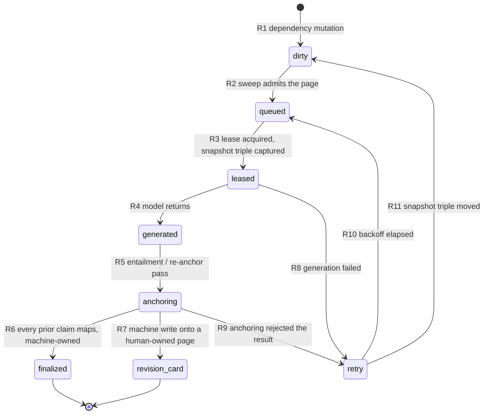

# M6 Stage-0 artifact 7 — refresh matrix: dependency invalidation, claim anchoring, human-card policy

Status: Stage-0 contract artifact. Normative for PR-A onward.
Scope: frozen contract D10, and the parts of D8's caps that bind refresh.
Builds on machine E of artifact 2 (`2026-08-01-m6-state-machines.md` §8) for the
finalization atomicity, and on the D12 writer manifest
(`2026-08-01-m6-d12-writer-manifest.md`) for the enumeration of refresh writers.
Gate: G7 (`m6_refresh_preserves_truth`).

**Approved amendment (2026-08-02; D4=A, D7=A).** `queued` remains row-less and
`generated` remains in memory. Lease acquisition atomically inserts or claims a
durable `leased` row before model work, with the snapshot triple and the job's
space, readiness epoch, schema version, and reason. The active-job unique
predicate is exactly `state IN ('leased','retry')`. Finalization also replaces
the page's exact durable `m6_refresh_dependencies` snapshot in its existing
outer page/truth/history/receipt/outbox transaction. That snapshot records
`(space, page_id, page_version, claim_revision_id, root_id)`; `root_id` has no
cascade-away foreign key, so a missing root remains visible to readiness.

**Grounding (rev 2, findings 2 and 15).** In-repo `file:line` citations were read
on branch `kg-m6-stage0`, based on **`origin/main` `1c903bec`** — PR #418, *"close
the M5 daemon gaps"*. Rev 1 was written against `e39048c7` (release 0.15.2), which
`#418` has since superseded; every citation in this artifact was mechanically
re-pinned to `1c903bec` and re-verified to resolve to byte-identical source text,
so no claim moved, only the numbers. App-repo citations are read from
**`wenlan-app` `origin/main` `1d71aa4`** — resolved from that ref rather than from
a working tree, because the local app checkout sits behind `origin/main`. That
checkout is the user's; nothing in this work modifies it. Verify a citation with
`git show origin/main:<path>` inside the app repo.

---

## 1. The refresh state flow

D10 fixes the states. This section fixes what each one *is* on disk.



| State | What it is on disk | Seam |
|---|---|---|
| `dirty` | `pages.stale_reason IS NOT NULL` | `set_page_stale` (`crates/wenlan-core/src/db.rs:46115`) |
| `queued` | no row of its own — the page is in the sweep's selection | `list_stale_pages` (`crates/wenlan-core/src/db.rs:46351`); the sweep *is* the queue |
| `leased` | `genesis_refresh_jobs` row holding the snapshot triple plus space/readiness-epoch/schema/reason (PR-A-new) | §1.1 |
| `generated` | in-memory only; the model output is not durable until it anchors | — |
| `anchoring` | in-memory; the claim map is computed before any write | §2 |
| `finalized` | `pages` row advanced by the M5 finalizer | `try_update_page_content` (`crates/wenlan-core/src/db.rs:42422`) |
| `revision_card` | `memories` row with `pending_revision=1, supersedes=<page id>` | `stage_page_revision_card` (`crates/wenlan-core/src/post_write/page_update.rs:122`) |
| `retry` | `genesis_refresh_jobs.attempt` + `next_attempt_at` (PR-A-new) | reuses S0-2's backoff |

> **Decision S0-55 — `queued` gets no durable row; it is the sweep's selection,
> not a persisted queue.** This mirrors §1.4 of artifact 5 and the same reasoning
> applies: a persisted queue is a second truth about which pages need refreshing,
> and `stale_reason` already is that truth. The tree agrees — the comment on
> `enqueue_changed_pages` (`crates/wenlan-core/src/refinery/mod.rs:1391`-`:1392`)
> says *"the stale-page sweep is the sole LLM executor, so every refresh reaches
> the same stale-only CAS."*

### 1.1 The snapshot triple

D10: *"Capture page version, dependency generation, and active-root-set digest."*

| Component | Value | Source |
|---|---|---|
| page version | the pair `(pages.version, pages.source_revision)` at lease time — see F1 and S0-70 for why one column is not enough | the CAS tokens every existing refresh writer already uses (`crates/wenlan-core/src/post_write/page_update.rs:839`, `:852`, `:865`) |
| dependency generation | `space_graph_state.grouping_generation` (`crates/wenlan-core/src/db.rs:10474`) | same counter as S0-1 |
| active-root-set digest | `m6_digest` over `sorted_set((root_id, status))` for the page's supporting roots | artifact 4 §5 field 8 |

> **Decision S0-56 — the triple is captured inside the lease acquisition
> transaction, and re-read (not re-derived) at finalize.** Capturing outside the
> lease leaves a window where the page moves between snapshot and lease, and the
> job then holds a triple that never described a real state. Re-reading at
> finalize rather than re-deriving means the finalize CAS compares stored values,
> which is what makes a crash-restart test reproducible.

The durable row stays `leased` while generation and anchoring happen. There is
no durable `generated` transition: generated prose exists only in memory until
the existing all-or-nothing finalizer commits it or the job moves to `retry`.

---

## 2. The claim-anchoring matrix

This is the part G7 exists to assert: *"Every previously supported claim maps
one-to-one to an unchanged or successor claim. Any wrong/ambiguous target or
anchoring failure rejects the entire result."*

### 2.1 The three legal outcomes

For each claim that was `supported` on the page's prior version:

| Outcome | Meaning | Evidence required | Durable effect |
|---|---|---|---|
| **unchanged** | the claim's text and its supporting root set are both identical | prior claim's canonical digest equals the new claim's, **and** the supporting root set is unchanged | the claim's support row carries forward at the new page version |
| **successor** | the claim was reworded or its evidence moved, but it is the same assertion | an entailment judgment, from the independent judge, that the new claim is entailed by the same evidence the prior claim was supported by — **plus** a one-to-one target: exactly one new claim names this prior claim as its predecessor, and this prior claim is named by exactly one new claim | a successor edge from prior claim to new claim, written in the finalize transaction |
| **rejected** | the claim is no longer asserted at all | the new text contains no claim entailed by the prior claim's evidence, and the prior claim is named by no new claim | **the entire refresh is rejected** — see S0-57 |

> **Decision S0-57 — "rejected" is not a per-claim outcome that the refresh can
> absorb; a single rejected prior-supported claim rejects the whole result.**
> D10's sentence is "*every* previously supported claim maps one-to-one to an
> unchanged or successor claim," so a claim with no target is an anchoring
> failure, and the same sentence's second half makes an anchoring failure fatal
> to the result. The row is kept in the matrix because a reviewer needs to see
> that the third outcome was considered and deliberately made terminal, not
> because it is a path the refresh can take and continue.
>
> Consequence worth naming: **a refresh cannot drop support.** A page that
> genuinely should stop asserting something needs a human, not a refresh. That
> is the anti-support-loss property D10's title claims and it costs real
> automation — an out-of-date page stays out of date rather than quietly
> shedding a claim.

### 2.2 The ambiguity cases

"Wrong or ambiguous target" is where an implementation quietly gets this wrong,
so it is enumerated rather than described. Every row below rejects the entire
result.

| # | Case | Shape | Why it is not resolvable |
|---|---|---|---|
| M1 | **Fan-out** | one prior claim, two or more new claims each entailed by its evidence | D10 says one-to-one. Picking the "best" successor invents a judgment nobody made, and splitting support across both doubles a single piece of evidence's weight |
| M2 | **Fan-in** | two or more prior claims, one new claim entailed by both evidence sets | The merged claim would inherit two support histories, so a later retraction of one prior claim's evidence has no defined effect |
| M3 | **Swap** | prior A best-matches new B and prior B best-matches new A, but a naive greedy pass pairs A→A | The greedy pass produces a *wrong* target with no ambiguity signal at all — it looks like a clean match. Detection requires checking that the mapping is a bijection, not that each claim found a match |
| M4 | **Tie** | one prior claim, two new claims with indistinguishable entailment verdicts | Same as M1 but harder to see, because a scoring implementation will break the tie by float noise and report a confident answer |
| M5 | **Orphaned successor** | a new claim names a predecessor that was not supported on the prior version | The refresh is claiming inheritance from something that never had support to inherit |
| M6 | **Self-reference** | a new claim names itself as its predecessor | Degenerate, but a fingerprint collision or a canonicalization bug produces it, and it would otherwise pass a naive one-to-one check |
| M7 | **Cycle** | prior A → new B, prior B → new A, both asserted as successors | Bijective, so M3's check passes; it is still wrong because the two claims exchanged identity |
| M8 | **Evidence drift** | a claim maps one-to-one and is entailed, but by a *different* root set than supported it before | The mapping is fine; the support is not. Silently re-anchoring to new evidence means the page's support history stops describing why it was ever believed |
| M9 | **Retracted-root anchor** | the successor's entailment rests on a root whose `provenance_roots.status` moved off `active` (`crates/wenlan-core/src/db.rs:8793`) between lease and finalize | The snapshot triple's root digest catches this at the finalize CAS; enumerated so the check is not left to the entailment judge |
| M10 | **Ungrounded anchor** | the successor's entailment rests on an edge with `grounded = 0` (`crates/wenlan-core/src/db.rs:8811`) | Extraction proposes, the validator grounds; an ungrounded edge is a proposal, and support may never rest on one |

> **Decision S0-58 — the mapping is checked as a bijection over the
> prior-supported claim set, not as a per-claim search.** M3 and M7 are the
> reason: both produce a mapping where every claim individually found a target,
> and only a whole-mapping check sees the problem. Concretely: build the map,
> assert `|domain| == |image| == |prior supported set|`, then assert no claim
> appears twice on either side. A per-claim loop cannot express this.

> **Decision S0-59 — M8 (evidence drift) rejects rather than re-anchors.** The
> softer alternative — accept the successor and record the new root set — is
> tempting because the claim is still true. It is refused because the support
> history is the artifact that answers "why did we ever believe this", and
> rewriting it in place makes every prior receipt describe evidence the page no
> longer rests on. A genuine evidence change is a new claim, which is a human's
> call.

### 2.3 The rejection is all-or-nothing

> **Decision S0-60 — a rejected refresh writes nothing to `pages` and consumes no
> staleness.** It advances `attempt` and `next_attempt_at` on the job row and
> nothing else. Specifically it must **not** clear `stale_reason`: the page is
> still stale, the refresh just failed, and clearing staleness would convert a
> failed refresh into a permanently un-refreshed page — the parking failure
> artifact 5 §8 enumerates, in a different lane.
>
> The tree already holds this rule for the existing lane — the comment on
> `re_distill_stale_pages` says *"No-op refreshes stay stale so a later sweep can
> retry"* (`crates/wenlan-core/src/refinery/mod.rs:1420`-`:1421`). S0-60 extends
> the same principle from "produced nothing" to "produced something that failed
> anchoring."
>
> Note the deliberate contrast with the *gated* path, which does clear staleness
> at the source revision (`crates/wenlan-core/src/post_write/page_update.rs:656`-`:663`)
> because a revision card means the work landed. Rejection is the case where it
> did not.

---

## 3. Dependency invalidation

### 3.1 What marks a page dirty today

| # | Trigger | Seam | Reason literal | D10 accounts for it? |
|---|---|---|---|---|
| 1 | a page's explicit source memories changed | `enqueue_changed_pages` → `set_page_stale` (`crates/wenlan-core/src/refinery/mod.rs:1402`), driven by `has_page_sources_changed` at `:1398` | `source_updated` | yes — this is D10's canonical dependency mutation |
| 2 | the redistill slice re-marks a page it could not finish | `crates/wenlan-core/src/refinery/mod.rs:1680` | `source_updated` | yes |
| 3 | overview sync | `crates/wenlan-core/src/synthesis/overview.rs:118` | `overview_sync` | partly — D11 governs overviews, so the refresh matrix must not treat this as an ordinary dependency mutation. See S0-61 |
| 4 | topic-match upsert on memory store | documented at `crates/wenlan-core/src/refinery/mod.rs:1412`-`:1413` | `source_updated` | yes |
| 5 | a new evidence link on the page | `link_page_evidence` (`crates/wenlan-core/src/db.rs:45223`), statement at `:45248`-`:45253` | `source_updated` | **no — see finding F1** |
| 6 | the citation-backfill lane's annotate write | `set_page_citations_with_changelog_at_version` (`crates/wenlan-core/src/db.rs:45178`, statement at `:45188`-`:45190`) | — mutates `pages`, marks nothing, advances no version | **no — see finding F2** |

> **Decision S0-61 — `overview_sync` staleness is routed to D11's overview
> machinery, not to the D10 refresh matrix.** An overview's claims are
> summarizations of a community, not assertions with independent root support, so
> the §2 bijection has nothing to run over. Artifact 8 owns the overview refresh
> path; this artifact owns concept and entity pages. The two must be
> distinguishable at the sweep, and `stale_reason` already distinguishes them.

### 3.2 Coalescing

D10: *"Coalesce one active job/card per page and base version."*

> **Decision S0-62 — the coalescing key is `(page_id, base_page_version)` and it
> is enforced by a partial unique index on the job table, not by a
> check-then-insert.** `CREATE UNIQUE INDEX … ON genesis_refresh_jobs(page_id,
> base_page_version) WHERE state IN ('leased','retry')`. The
> index is the enforcement so a second sweep cannot open a duplicate job in the
> window between a read and a write — the same hazard artifact 5's finding F1
> found in the existing discovery-card path.

This predicate is the amendment to the earlier four-state wording: `queued`
cannot appear because selection is row-less, and `generated` cannot appear
because the output remains in memory while its durable job remains `leased`.

### 3.2.1 The durable dependency snapshot

`m6_refresh_dependencies` is the current exact dependency snapshot for a page,
not a view over current M5 support. Each row carries `space`, `page_id`,
`page_version`, `claim_revision_id`, and `root_id`. Genesis and refresh
finalization replace all rows for that page inside the same outer transaction
that advances the page and writes truth, history, receipt, and outbox effects.
There is no helper-owned commit, so a failed finalization rolls back the page and
dependency replacement together.

The `root_id` column intentionally does not reference `provenance_roots` with a
delete cascade. PR-D precondition 5 is the fail-closed anti-join:

```sql
SELECT count(*)
  FROM m6_refresh_dependencies d
  LEFT JOIN provenance_roots r ON r.root_id = d.root_id
 WHERE d.space = ?1
   AND (r.root_id IS NULL OR r.status <> 'active');
```

Any non-zero result blocks cutover. A later successful finalization repairs the
condition by atomically replacing the incompatible current snapshot with the
new page-version/claim/root set.

The revision card gets the same treatment: at most one open card per
`(page_id, page_version)`. The card's structured payload already carries both
(`crates/wenlan-core/src/post_write/page_update.rs:141`-`:149`: `revises_page`
and `page_version`), so the key exists; what is missing is the uniqueness
enforcement, since the card ID is a fresh UUID
(`crates/wenlan-core/src/post_write/page_update.rs:132`-`:140`).

> **Decision S0-63 — M6's refresh card ID is derived, not a UUID:
> `m6_digest("m6-refresh-card-v1", [page_id, page_version])` per artifact 4 §2.**
> A UUID card ID cannot be coalesced without a lookup, and the lookup has the
> check-then-insert window. A derived ID makes `INSERT OR IGNORE` the whole
> coalescing mechanism. This does not change the existing card path — it is what
> the M6 refresh finalizer uses.

### 3.3 The 64-root cap

D10: *"Automatic refresh considers at most 64 roots."*

> **Decision S0-64 — the 64 roots are selected deterministically by
> `sorted_set` order (artifact 4 S0-30) over the page's supporting root IDs, and
> a page whose prior-supported claims rest on roots outside the first 64
> **rejects the refresh** rather than refreshing against a subset.**
>
> This is the one place a cap is allowed to look like a terminal outcome, and it
> is not one: the job goes to `retry` with `reason='root_cap_exceeded'` and the
> page stays dirty, so §2.3 and artifact 5's S0-54 both still hold. Refreshing
> against a subset would make every claim resting on root 65+ an M8
> evidence-drift or an outright unanchorable claim — the cap would manufacture
> exactly the failure §2 exists to prevent. Sorting rather than sampling means the
> selection is reproducible, so the same page rejects consistently instead of
> flapping.

Consequence: a page with more than 64 supporting roots never auto-refreshes. That
is a real ceiling and it should be visible, which is what the retry reason is for.

### 3.4 The 20-card cycle cap and the batched remainder

D10: *"One structural event may stage at most 20 individual cards per cycle; the
remainder becomes one batched review action."*

> **Decision S0-65 — the count is per `(structural event, cycle)`, counting
> **cards actually inserted**, and the 21st card and beyond fold into exactly one
> batched action per `(structural event, cycle)`.**
>
> Three counting questions and their answers:
>
> - **Do coalesced no-ops count?** No. A card that `INSERT OR IGNORE` skipped
>   because one already existed for `(page, version)` did not stage anything, so
>   it does not consume budget. Counting attempts instead of insertions would let
>   a repeated sweep exhaust the budget without surfacing anything.
> - **Does the batched action count toward the 20?** No. It is the overflow
>   container, not a 21st card; counting it would make the effective cap 19.
> - **What is a "cycle"?** One refinery turn, the same unit D8's
>   one-LLM-finalization budget uses (`AmbientBudgetProvider`,
>   `crates/wenlan-server/src/scheduler.rs:455`). A second unit here would be a
>   second answer to "how often does automatic work happen."
>
> The batched action's ID is derived the same way as S0-63, keyed on
> `(structural_event_id, cycle_generation)`, so a repeated cycle coalesces onto
> the same batch rather than growing a pile.

---

## 4. Human-owned pages

### 4.1 The predicate, and its two enforcement layers

```rust
// crates/wenlan-core/src/post_write/page_update.rs:111-113
pub fn page_is_human_owned(page: &crate::pages::Page) -> bool {
    page.user_edited || page.creation_kind == "authored"
}
```

The tree enforces this **twice**, and the distinction matters for what M6 can
rely on:

| Layer | Where | Strength |
|---|---|---|
| Rust-side gate inside the CAS loop | `crates/wenlan-core/src/post_write/page_update.rs:641` — `if writer.is_machine() && page_is_human_owned(&current)` | advisory: it re-evaluates on every attempt (the comment at `:638`-`:640` says so) but it is still a read followed by a decision |
| In-statement guard on the UPDATE | `crates/wenlan-core/src/db.rs:42550` and `:42571` (and `:42672`, `:42692` on the second arm) — `AND COALESCE(user_edited, 0) = 0` | durable: a page that became human-owned after the read makes the UPDATE match zero rows, so the write silently becomes a no-op rather than an overwrite |

> **Decision S0-66 — M6's refresh finalizer relies on the in-statement guard as
> the guarantee and treats the Rust-side gate as routing only.** The Rust check
> decides *which path to take* (write vs stage a card); the SQL predicate decides
> *whether the write may land*. G7's byte-identical-prose assertion should be
> written against the SQL layer, because that is the one an implementation cannot
> accidentally skip by adding a new caller.

### 4.2 The byte-identical guarantee

A machine refresh of a human-owned page must leave `pages.content` byte-identical.
The existing path satisfies this by never issuing the UPDATE at all: it calls
`stage_page_revision_card` (`crates/wenlan-core/src/post_write/page_update.rs:642`-`:650`)
and returns a gated `WriteResult`.

> **Decision S0-67 — "byte-identical" is asserted on `pages.content`, `pages.version`,
> and `pages.changelog` together, not on content alone.** A refresh that left the
> prose alone but bumped the version would invalidate every other job's snapshot
> triple and would make the page look edited to the projection layer. The three
> columns are the observable state of "this page did not move."

### 4.3 One card, and what happens to it

| Event | Effect |
|---|---|
| a second refresh produces the same card key | `INSERT OR IGNORE` on the derived ID (S0-63) — no second card |
| the human accepts | `try_accept_page_revision` (`crates/wenlan-core/src/db.rs:42382`) applies the content and consumes the card **in one transaction** |
| the human dismisses | the card is resolved; per artifact 5 §4's reasoning the dismissal writes a suppression so the same `(page, version)` card is not re-proposed |
| the card expires | the page returns to `dirty` — the work was never done, so it must be re-offered |
| the page moves under an open card | the card's `(page_id, page_version)` key no longer matches; the card is stale and a new one may be staged for the new version |

> **Decision S0-68 — card expiry returns the page to `dirty`, dismissal does
> not.** Expiry means nobody decided; dismissal means somebody decided no.
> Collapsing them either nags after a decision or drops work after silence. This
> mirrors machine F's F8-vs-F7 split exactly, and deliberately so — the same
> distinction, one level down.

Staleness bookkeeping on the gated path is already correct in the tree and M6
should not change it: the gated write clears staleness *at the source revision*
(`crates/wenlan-core/src/post_write/page_update.rs:656`-`:663`), which the comment
at `:651`-`:655` explains — the work landed as a card, so the page must not be
recompiled next sweep, but a source that moved since dispatch leaves it stale.

---

## 5. The machine-owned publish path

The dispatch asked for the actual M5 all-or-nothing finalizer. It is:

**`MemoryDB::try_update_page_content`, `crates/wenlan-core/src/db.rs:42422`.**

Every page-content writer in the workspace funnels into it. The public variants
are thin wrappers that differ only in which CAS token they supply:

| Wrapper | CAS token | Line |
|---|---|---|
| `try_update_page_content_with_changelog_at_source_revision` | source revision | `crates/wenlan-core/src/db.rs:42231` |
| `try_update_page_content_with_changelog_at_version` | page version | `:42313` |
| `try_update_page_growth_at_versions` | page version + source revision + memory version | `:42348` |
| `try_accept_page_revision` | optional page version, consumes the card | `:42386` (doc `:42383`-`:42385`) |

Its doc comment (`:42413`-`:42420`) states the atomicity contract: the changelog
and the citations map are written atomically with the content, and
`consume_revision_id` makes card consumption part of the same transaction. The
transaction opens at `:42484`.

Above it, `PageWrite` (`crates/wenlan-core/src/post_write/page_dispatch.rs:13`) is
the enum G9's manifest names, dispatched by `page_write` and re-exported from
`crates/wenlan-core/src/post_write.rs:27`. The refresh lane reaches it
through `update_page_at_source_revision`
(`crates/wenlan-core/src/post_write/page_dispatch.rs:333`), which is what
`refresh_page_with_prompt` calls (`crates/wenlan-core/src/synthesis/distill.rs:1360`,
per the D12 manifest).

> **Decision S0-69 — M6's refresh finalizer extends `try_update_page_content`
> rather than opening a parallel transaction.** D10 says machine-owned pages
> publish only through the M5 all-or-nothing finalizer, and a second transaction
> would mean the claim-successor edges and the page content could disagree after a
> crash. The M6 additions — successor edges, the support carry-forward, the job
> row's terminal stamp — go inside the existing `BEGIN` at
> `crates/wenlan-core/src/db.rs:42484`.

---

## 6. Findings against the tree

**F1 — linking a new piece of evidence marks the page dirty *and* advances the
refresh lane's other CAS token, in the same statement.** `link_page_evidence`
(`crates/wenlan-core/src/db.rs:45223`) runs, when and only when the evidence row
was actually new (`if inserted > 0`, `:45246`):

```sql
-- crates/wenlan-core/src/db.rs:45248-45249
UPDATE pages
   SET citations = NULL,
       stale_reason = 'source_updated',
       sources_updated_count = COALESCE(sources_updated_count, 0) + 1,
       source_revision = COALESCE(source_revision, 0) + 1
 WHERE id = ?1
```

This is a legitimate dependency mutation — evidence genuinely changed — so it
belongs in the §3.1 table rather than being a bug. What makes it a finding is the
last line. It advances `source_revision`, which is one of the two CAS tokens the
refresh lane writes against
(`try_update_page_content_with_changelog_at_source_revision`,
`crates/wenlan-core/src/db.rs:42231`), while the function's own doc comment
(`:45219`-`:45222`) states that *"the content generation stays untouched"* —
`pages.version` does not move.

So an evidence link lands in a blind spot between the two CAS axes: a refresh
holding a version-keyed snapshot sees nothing, and a refresh holding a
source-revision-keyed snapshot conflicts. **D10's snapshot triple must therefore
name which token it binds**, and S0-56's "page version" is not sufficient on its
own. Stage-0 resolution: the triple's page-version component is
`(pages.version, pages.source_revision)` as a pair, not `version` alone.

> **Decision S0-70 — the snapshot triple's first component is the pair
> `(version, source_revision)`.** One token cannot see both content moves and
> evidence moves, and a refresh must be invalidated by either. This supersedes
> the single-column reading of S0-56; the other two components are unchanged.

**F2 — the citation-backfill lane mutates `pages` without advancing
`pages.version`, so it is invisible to every version-based CAS.**
`set_page_citations_with_changelog_at_version`
(`crates/wenlan-core/src/db.rs:45178`) issues:

```sql
-- crates/wenlan-core/src/db.rs:45188-45190
UPDATE pages SET citations = ?1, changelog = ?2
 WHERE id = ?3 AND version = ?4 AND status = 'active'
   AND citations IS NULL
```

There is no `version = version + 1`. So this interleave is reachable: a refresh
leases page P at version N; the citation lane annotates P at version N; the
refresh finalizes, its CAS still matches because the version never moved, and
`try_update_page_content`'s documented rule (`:42415`-`:42418`) resets
`citations` to NULL on a content change. The annotation is discarded with no
conflict signal.

**The severity is lower than it first looks, and the tree says so explicitly.**
That same doc comment gives the reason for the reset — it *"keeps the new body
eligible for annotation"* (`:42418`) — and the annotate statement's
`AND citations IS NULL` guard (`:45190`) is what makes re-annotation the natural
next state rather than a permanently-half-annotated page. The lost work is
re-doable on a later tick. So this is wasted LLM budget under contention, not
lost information, and no §2 claim rule is violated.

What Stage 0 records is therefore narrower than "a bug": **`pages.version` is not
a mutation counter, and D10 must not treat it as one.** Any M6 rule phrased as
"the page did not change if the version did not change" is false — F1 and F2 are
two different mutations that leave it fixed. The §3.2 coalescing key inherits
this: `(page_id, base_page_version)` coalesces refresh *jobs*, which is
version-scoped work, and that remains correct; it just may not be read as a
statement that the page is otherwise untouched.

**G-catalog case `C-refresh-citation-clobber`** (assert the interleave is
survivable and the page ends annotatable, not that it never happens).

**F3 — `try_update_page_content` opens a deferred transaction, not `BEGIN
IMMEDIATE`** (`crates/wenlan-core/src/db.rs:42484`, plain `conn.execute("BEGIN",
())`). A deferred transaction takes its write lock at the first write, so a
reader-then-writer sequence can meet `SQLITE_BUSY` mid-transaction rather than at
`BEGIN`. Harmless today — the daemon is the single writer on one connection — but
it differs from the `BEGIN IMMEDIATE` pattern the M5 presence endpoint adopted,
and M6 is about to put more work inside this transaction. Worth one line of
consideration in PR-A rather than a change now.

**F4 — the existing revision card ID is a fresh UUID**
(`crates/wenlan-core/src/post_write/page_update.rs:132`-`:140`), so nothing
structurally prevents two cards for the same `(page, version)`. The
`emit_cross_space_discovery_card` pattern guards its analogue at the caller;
`stage_page_revision_card` has no such guard, so coalescing currently depends on
callers not calling twice. S0-63 closes it for the M6 lane; the existing lane is
out of scope.

---

## 7. Gate mapping

| Gate | What this artifact hands it |
|---|---|
| G7 (`m6_refresh_preserves_truth`) | M1–M10 (§2.2) as the ambiguity case list; S0-58's bijection check as the assertion shape; S0-67's three-column byte-identity assertion; the positive control is a machine refresh of a machine-owned page whose claims all map `unchanged` |
| G6 (abuse bounds) | S0-64's root-cap rejection and S0-65's three counting answers |
| G9 (writer fencing) | §5's finalizer identification — `try_update_page_content` is the symbol the per-caller mutation tests must prove no listed path bypasses |
| G-catalog | `C-refresh-citation-clobber` (F2); `C-refresh-evidence-link-blindspot` (F1 — link evidence to a leased page, assert the refresh conflicts rather than committing against evidence it never saw); M3 and M7 as the two cases a per-claim implementation passes and a bijection check fails |

---

## 8. Decisions introduced here

`S0-55` `queued` has no durable row ·
`S0-56` snapshot triple captured inside the lease, re-read at finalize ·
`S0-57` one rejected prior-supported claim rejects the whole refresh ·
`S0-58` the claim map is checked as a bijection, not per-claim ·
`S0-59` evidence drift rejects rather than re-anchors ·
`S0-60` a rejected refresh consumes no staleness ·
`S0-61` `overview_sync` staleness routes to D11, not to this matrix ·
`S0-62` coalescing key `(page_id, base_page_version)` enforced by a partial unique index ·
`S0-63` refresh card IDs are derived, not UUIDs ·
`S0-64` the 64-root cap rejects rather than refreshing against a subset ·
`S0-65` the 20-card cap counts insertions, excludes the batch, and uses the refinery turn as its cycle ·
`S0-66` the in-statement `user_edited` guard is the guarantee; the Rust gate is routing ·
`S0-67` byte-identity is asserted over content, version, and changelog together ·
`S0-68` card expiry returns the page to `dirty`; dismissal does not ·
`S0-69` the M6 refresh finalizer extends `try_update_page_content`, never a parallel transaction ·
`S0-70` the snapshot triple's first component is the pair `(version, source_revision)`, not `version` alone.
