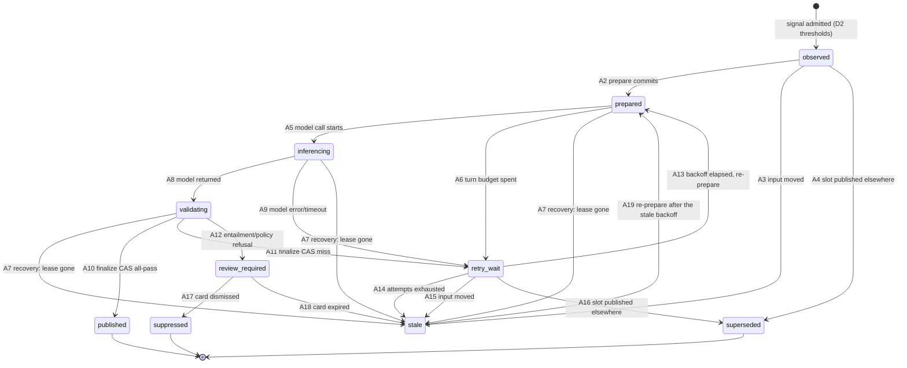
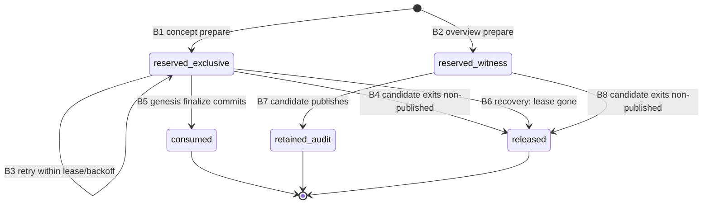
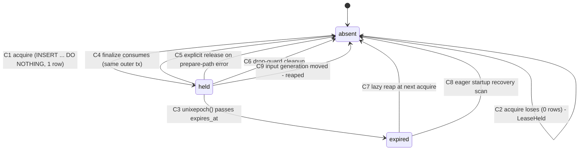
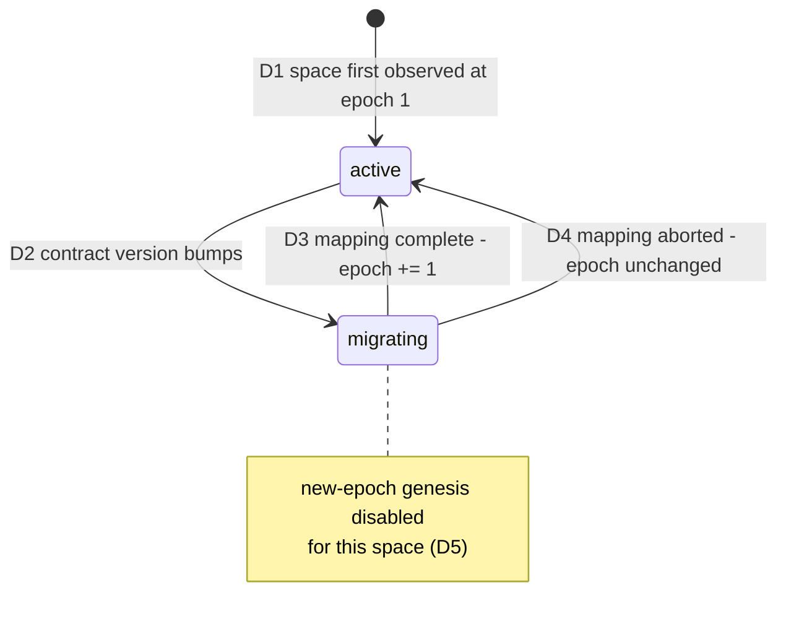
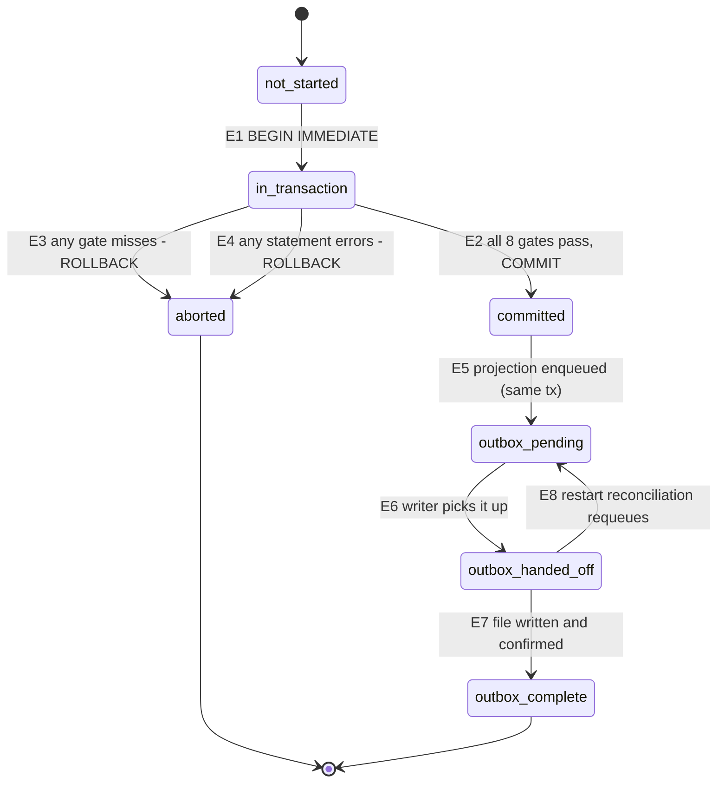
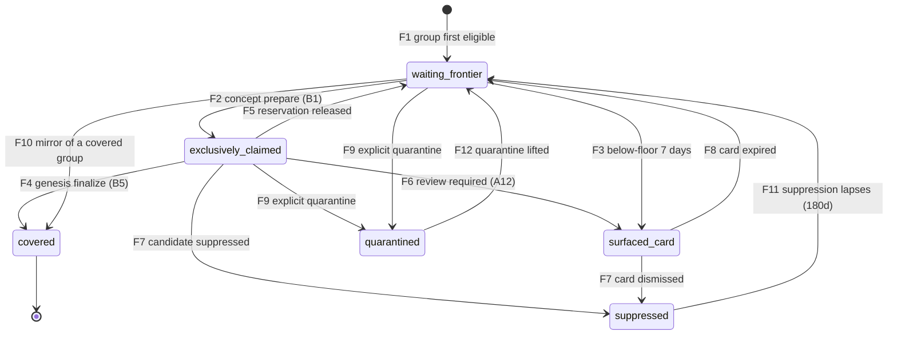

# M6 Stage-0 artifact 2 — candidate, claim, lease, coverage-epoch, and finalization state machines

**Grounding (rev 2, findings 2 and 15).** In-repo `file:line` citations were read
on branch `kg-m6-stage0`, based on **`origin/main` `1c903bec`** — PR #418, *"close
the M5 daemon gaps"*. Rev 1 was written against `e39048c7` (release 0.15.2), which
`#418` has since superseded; every citation in this artifact was mechanically
re-pinned to `1c903bec` and re-verified to resolve to byte-identical source text,
so no claim moved, only the numbers. App-repo citations are read from
**`wenlan-app` `origin/main` `1d71aa4`** — resolved from that ref rather than from
a working tree, because the local app checkout sits behind `origin/main`. That
checkout is the user's; nothing in this work modifies it. Verify a citation with
`git show origin/main:<path>` inside the app repo.

**Sources.** Frozen goal prompt sections D3 (candidate machine + atomic finalization), D4 (concept claims vs overview witnesses + reservation terminal semantics), D5 (deterministic identity/retry), D6 (one durable lease registry, one LLM finalization per turn), D7 (durable frontier), D8 (work bounds), D14 (forward-safe rollback). Gates G3, G4, and G5 are the executable consumers of this artifact.

**How to read this.** The **transition tables are normative.** The Mermaid diagrams beside them are a reading aid and carry no information the table does not; where they disagree, the table wins. Section 3 lists every place the contract left a choice open and the choice this artifact makes — those are the lines a reviewer should veto or accept, because everything downstream of them is mechanical.

**Revision log.** Rev 2 (review finding 3) makes `stale` a re-enterable state
rather than terminal-final, adding transition A19 and decision S0-151. Rev 1's
S0-numbers are unchanged; nothing was renumbered.

**Status.** Contract only. No schema, no code. Per Stage 0, no M6 schema or production code begins until the prerequisite gate is current and green against post-M5 `main`.

---

## 1. Six machines, and why six

The Stage-0 list names five machines. This artifact specifies six. The extra one is the group/frontier reconciliation machine (§9), and it earns its place because **D4's closing rule is stated over groups, not candidates**:

> Every group outside the waiting frontier must have exactly one durable reason: an active bounded reservation, permanent coverage, surfaced review, time-bounded suppression, or explicit quarantine.

That sentence cannot be expressed in any of the other five machines — a candidate can be `stale` while its group is `covered` by a different candidate, and a lease can be `absent` while three groups sit in `waiting_frontier`. The invariant lives on an object none of the five machines is about. G5 (`m6_frontier_has_no_missing_root`) asserts exactly this, so the machine has to exist somewhere; making it implicit would leave the gate with no contract to test against.

| # | Machine | Object it describes | Durable home | Gate |
|---|---|---|---|---|
| A | Candidate | one candidate attempt at one slot | `genesis_candidates` (new) | G3 |
| B | Claim / reservation | one (candidate, root) pair | `genesis_candidate_roots` (new) | G3 |
| C | Lease | one (phase, space, input generation) operation | `grouping_leases` (**exists**) | G3 |
| D | Coverage epoch | one space's identity-contract era | `genesis_coverage_state` (new) | G10 |
| E | Finalization | one publish attempt's atomicity | the outer transaction + `page_projection_outbox` | G4 |
| F | Group / frontier | one independence group in one epoch | `genesis_frontier` + `genesis_group_coverage` (new) | G5 |

Only machine C has an existing physical substrate. The other five are contract-first; PR-A introduces their tables disabled.

---

## 2. The substrate that already exists

### 2.1 The lease registry D6 extends

```
crates/wenlan-core/src/db.rs:10479
    CREATE TABLE IF NOT EXISTS grouping_leases (
        phase TEXT NOT NULL,
        space TEXT NOT NULL,
        input_generation INTEGER NOT NULL,
        token TEXT NOT NULL,
        expires_at INTEGER NOT NULL,
        attempt INTEGER NOT NULL DEFAULT 0,
        PRIMARY KEY(phase, space, input_generation)
    );
```

The table already has the shape D6 asks for. Exactly one phase value is written today — `'community'` — and every statement that touches the table is scoped to it by a literal:

| Operation | Location | Statement shape |
|---|---|---|
| Reap-then-acquire | `crates/wenlan-core/src/db.rs:13431` and `:13443` | `DELETE ... WHERE phase='community' AND space=?1 AND (expires_at <= unixepoch() OR input_generation <> ?2)` then `INSERT ... VALUES ('community', ?1, ?2, ?3, unixepoch() + 300, 1) ON CONFLICT(phase, space, input_generation) DO NOTHING` |
| Acquire failure | `crates/wenlan-core/src/db.rs:13455` | `INSERT` affected 0 rows → `CommunityGroupingError::LeaseHeld` |
| Release on prepare-path error | `crates/wenlan-core/src/db.rs:13746` | `DELETE ... AND token=?3` |
| Ownership CAS at finalize | `crates/wenlan-core/src/db.rs:13923` | `SELECT 1 FROM grouping_leases WHERE phase='community' AND space=?1 AND input_generation=?2 AND token=?3 LIMIT 1` — missing row aborts the finalize |
| Consume at finalize | `crates/wenlan-core/src/db.rs:14135` | `DELETE ... AND token=?3`, inside the same outer immediate transaction as the publish |
| Drop-guard cleanup | `crates/wenlan-core/src/db/community_grouping_state.rs:51`–`:75` | spawned `DELETE` when a `CommunityGroupingLeaseCleanup` is dropped un-disarmed |

Four facts from that inventory shape the M6 design:

1. **The reap predicate is phase-scoped by a literal.** A naive M6 acquire that copies the statement and forgets to change `'community'` would reap a live lease belonging to another phase. The M6 acquire must parameterise `phase` in **both** the `DELETE` and the `INSERT`. This is the single most likely PR-A implementation defect and G3's lease-takeover leg should have a case for it.
2. **Acquisition is `INSERT ... ON CONFLICT DO NOTHING`, and zero affected rows is the "someone else holds it" signal.** That is already the CAS D6 wants; M6 reuses it verbatim rather than inventing a compare-and-swap.
3. **Ownership is re-checked at finalize, inside the transaction, before anything is written** (`crates/wenlan-core/src/db.rs:13923`, ahead of the generation CAS at `:13952`). M6's finalizer keeps that ordering — lease check first, so a lost lease costs nothing.
4. **`attempt` is declared but inert.** The only write is the literal `1` at `crates/wenlan-core/src/db.rs:13447`; no statement anywhere in the workspace updates it. M6 is free to give the column its intended meaning (decision **S0-2**).

The lease's `input_generation` for the community phase is `space_graph_state.grouping_generation`, read at `crates/wenlan-core/src/db.rs:13397` and `:13419` under `WHERE space = ?1 AND dirty = 1`.

### 2.2 The three surfaces that are *not* this registry

D6 says: *do not create a parallel lease system.* A reviewer will reasonably ask why the repo already contains three other things with "lease" in the name. It does, and none of them is a phase lease over automatic work:

| Surface | Location | Why it is not the registry, and why M6 does not extend it |
|---|---|---|
| `claim_derivation_jobs` | `crates/wenlan-core/src/db/claim_identity.rs:306`–`:322` | An M5 **per-(page, page_version) work-item lease** (`status IN ('pending','leased','done','parked')`, `lease_owner`, `lease_expires_at`, `attempts`). Its key is a page version, not `(phase, space, input_generation)`; its unit of exclusion is one page's claim derivation, not one phase's turn over a space. M6 genesis consumes its output through the M5 helpers and never takes one of its leases. |
| `CutoverLease` | `crates/wenlan-core/src/db/truth_exposure.rs:140`, minted at `:565`, consumed at `:591`/`:626` | Not durable and not a work lease: a non-`Clone` linear Rust value over the `app_metadata` cutover fence, deliberately usable exactly once so the compiler prevents a second commit (`:131`–`:138`). It gates a **human ceremony that is mutually exclusive with a running daemon** (`:659`–`:664`), so it can never contend with an automatic phase. Its stranded-`preparing` recovery at startup is a separate mechanism from lease expiry, for the reason stated at `:648`–`:657`: a lease dies with the process that minted it, and there is nothing alive to take it back. |
| `MaintenanceCoordinator` reservations | `crates/wenlan-server/src/maintenance_coordinator.rs:45`–`:50` | Process-local: `expires_at: Instant`, held in an in-memory `Mutex`, gone on restart by construction. It coordinates one approved repair against daemon-owned background writers within a single process. Nothing about it is durable, so it cannot be the registry and does not conflict with one. |

**Invariant I-6 (§10) is the machine-checkable form of this section:** the set of durable rows that grant exclusive execution rights to an automatic phase is exactly `grouping_leases`.

### 2.3 What does not exist yet

`genesis_candidate_roots`, `coverage_epoch`, and every other name in D3–D7 return zero hits across `crates/*/src`. Machines A, B, D, E, and F are therefore specified against tables PR-A creates, not against code. Only machine C is constrained by an existing implementation, and §2.1 is that constraint.

### 2.4 The turn budget

D8's `1 automatic LLM finalization per refinery turn` already has an enforcement point: `AmbientBudgetProvider` at `crates/wenlan-server/src/scheduler.rs:455`, an `LlmProvider` facade that `compare_exchange`es a shared counter from 0 to 1 and returns `LlmError::NotAvailable` on the second call (`:492`–`:504`). The refinery's phase set is `Phase` at `crates/wenlan-core/src/refinery/phase.rs:9`. M6 adds no counter of its own (decision **S0-9**).

---

## 3. Stage-0 decisions

Where the frozen contract leaves a choice open, this artifact makes it. Each is one line of rationale; reviewers veto decisions, not blanks.

| # | Decision | Rationale |
|---|---|---|
| **S0-1** | `input_generation` for all four M6 phases is the space's `space_graph_state.grouping_generation` — the same counter the community phase uses (`db.rs:13397`, `:13419`). | The existing reap arm `input_generation <> ?2` then invalidates every in-flight M6 lease for free the moment the space's graph substrate moves. Cost: a graph edit unrelated to an in-flight orphan-wikilink genesis requeues it. Per D3 a requeue publishes nothing and loses nothing, so the cost is one wasted inference, and the alternative — a second per-space counter — is a second truth about "has the input moved". |
| **S0-2** | `retry_wait` backoff is deterministic on `grouping_leases.attempt`: `delay = 60s * 4^(attempt-1)`, capped at 4h, **no jitter**; `attempt > 5` is exhaustion. Sequence: 60s, 4m, 16m, 64m, 4h. | The column already exists and is inert (§2.1 fact 4), so this costs no schema. No jitter because there is exactly one daemon per data root — there is no herd to disperse — and a deterministic schedule is what lets G3's crash matrix assert a specific next-attempt time rather than a range. Five attempts spans ~5.5h, so a transient model outage is ridden out within one day while a genuinely broken candidate reaches a terminal state the same day. |
| **S0-3** | Lease TTL is per phase: `frontier` 120s, `relevance` 300s, `genesis` 900s, `refresh` 900s. The binding rule is **TTL > (model call timeout + finalize budget)**; the numbers are the Stage-0 pick and must be re-derived from the configured LLM timeout at PR-A. | M4's 300s (`db.rs:13447`) is for a lease that spans no model call. `genesis` and `refresh` each span one on-device inference plus one entailment check, so a TTL at the M4 value would expire mid-inference on a cold model load and guarantee a finalize CAS miss. `frontier` holds a pure differential query and gets the shortest TTL so a crashed scan is retryable within one refinery interval. |
| **S0-4** | Leases are **not** renewed or heartbeated. Work that outlives its TTL loses the finalize CAS and requeues. | A renewal timer must hold lease state across the model call, which is the one thing D3 forbids spanning. The finalize ownership check (`db.rs:13923`) already makes takeover safe, so an expired lease costs one wasted inference, never a double publish. |
| **S0-5** | Startup recovery is an **eager** scan before the first refinery turn: delete every expired lease row, then release every exclusive reservation whose owning lease is gone (§11). M4's lazy reap-at-acquire is retained but is not sufficient for M6. | M4 only ever reads leases at acquire time, so lazy reaping is invisible. M6's frontier reconciliation reads *reservations* to decide whether a group has "an active bounded reservation" (D4), so a reservation orphaned by a killed process would hide its group from the frontier until something happened to acquire that exact `(phase, space, input_generation)` again — which for a space whose generation has since moved is never. That is precisely the "silently park evidence" outcome D7 forbids. |
| **S0-6** | Reservation activity is **stored** as `genesis_candidate_roots.released_at IS NULL`, not derived by joining to the lease. The recovery scan (S0-5) is what reconciles the stored bit with lease liveness. | D4 requires partial uniqueness on active concept claims. A SQLite partial unique index can only reference columns of its own table, so "active" has to be a column. Storing it creates a second truth that can disagree with the lease after a crash; naming the recovery scan as the sole reconciler is how that disagreement gets bounded to "until the next daemon start", instead of pretending it cannot happen. |
| **S0-7** | `coverage_epoch` is **per space** (`genesis_coverage_state.space` → `coverage_epoch`), while the identity-contract version that motivates an epoch bump is global. A space stays at its epoch until its own forward-mapping migration completes. | D14 requires a per-space cutover generation and per-space emergency disable; a global epoch would let one space's incomplete migration disable genesis everywhere, and the serial per-signal cutovers (PR-E1…E4) assume per-space independence. |
| **S0-8** | `coverage_epoch` is monotonically non-decreasing. A D14 rollback **disables the genesis phase for the space**; it never closes or decrements an epoch. | Permanent group-coverage rows are keyed by epoch. Decrementing would orphan them, and D14 forbids discarding coverage. Disable-in-place is also what makes rollback forward-safe: re-enabling resumes at the same epoch against the same coverage rows. |
| **S0-9** | The one-LLM-finalization-per-turn cap is enforced solely by the existing `AmbientBudgetProvider` (`scheduler.rs:455`). A candidate that receives `LlmError::NotAvailable` because the turn's budget is spent moves to `retry_wait` **without incrementing `attempt`**. | A second counter would be a second truth about the same fact. Not charging an attempt matters: a busy space would otherwise burn its five-attempt budget on turns where it never reached the model, converting a scheduling artefact into a permanent `stale`. |
| **S0-10** | D7 compaction at 90 days nulls the candidate *payload* columns and stamps `payload_compacted_at`. The candidate row, its receipt, its terminal state, and its coverage/suppression identities are never deleted. | D7 already says receipts, page genesis, human decisions, and suppression identities remain durable. G3 and G5 replay the terminal matrix and need the row to exist to assert against. |
| **S0-11** | Every durable timestamp and every timer comparison is `unixepoch()` evaluated by SQLite inside the statement itself, never a Rust-side `now` passed as a parameter. | The existing lease SQL already does this (`db.rs:13434`, `:13447`). One clock, and a test can move it only by moving stored values, which is what makes the crash matrix reproducible. |
| **S0-12** | Exhausted retry is **not** an eleventh candidate state. `retry_wait` with `attempt > 5` transitions to `stale` carrying `reason = 'retry_exhausted'`. | D3 fixes the state set at ten. G3 enumerates exhausted retry as its own crash case, so the *reason* has to be durable and distinguishable — but a distinct state would put this artifact out of contract with D3 for no gain. |
| **S0-151** *(rev 2, finding 3)* | `stale` is re-enterable, not terminal-final. Transition **A19** returns it to `prepared` when the frontier scan next reaches the group and `unixepoch() >= next_attempt_at`, with `attempt` reset to 0. The stale-stamping transition sets `next_attempt_at` from its own `reason`: `input_moved` → now; `lease_lost` → the S0-2 delay for the current `attempt`; `retry_exhausted` → +24h; `card_expired` → +180 days. | Without a re-entry edge the machine is unsatisfiable: `candidate_id` derives from `(slot_id, coverage_epoch)` alone (artifact 4, S0-40) and the row is never deleted (S0-10), so a group returned to `waiting_frontier` by A7, A14, or A18 could never form a candidate again inside its epoch. The per-reason delay is what keeps the edge from becoming a hot loop, and it reuses `next_attempt_at` rather than adding a column: `input_moved` wasted nothing and the fingerprint already differs; `retry_exhausted` burned five model attempts, so a day is the cheapest delay that is obviously not a loop; `card_expired` matches F7's 180-day suppression window because a human did see the card and let it lapse, which is a weaker signal than dismissal but not no signal. |

---

## 4. Machine A — candidate

**Object.** One attempt at one slot, identified by the candidate fingerprint of D5. **Durable home.** `genesis_candidates`: candidate ID, slot ID, page ID, space, signal kind, `coverage_epoch`, `input_generation`, `active_root_digest`, `state`, `reason`, `attempt`, `next_attempt_at`, `lease_token`, receipt ID, `payload`, `payload_compacted_at`, timestamps.

Per D5, a retry reuses the candidate, slot, page ID, lease operation, and receipt. The candidate row is therefore **stable across retries** — `attempt` and `state` move, identity does not.



**10 states, 19 transitions.** States `published`, `suppressed`, and `superseded` are terminal-final. `review_required` is terminal-pending (it leaves only by human action or expiry). `retry_wait` and `stale` both re-enter the primary path — `retry_wait` on the S0-2 backoff via A13, `stale` on the longer per-reason backoff of S0-151 via A19.

> **Rev-1 defect, corrected here (finding 3).** Rev 1 called `stale` terminal-final and drew `stale --> [*]`. That made the machine unsatisfiable in combination with two decisions elsewhere in the set. `candidate_id = m6_digest("m6-candidate-v1", [slot_id, coverage_epoch])` (artifact 4, S0-40) depends on nothing that a crash or an expiry changes, and S0-10 keeps the candidate row forever. So after A7, A14, or A18 returned a group to `waiting_frontier`, the next scan would derive the *same* `candidate_id`, find the durable `stale` row occupying it, and be unable to insert — the group would sit in the frontier permanently while the frontier's own contract (§11, D7) promised it was not lost. Artifact 4 had already assumed the correct machine: its §7.3 row *"Re-prepare after staleness"* names the transition `stale → prepared` outright, and S0-41's terminal set is `published`, `suppressed`, `superseded`, and open `review_required` — `stale` deliberately absent. Rev 1 of this artifact was the half of the pair that was wrong, and A19 is that transition made legal here too. The two artifacts now agree on one terminal set.

| # | From → To | Trigger | Guard | Durable effect | Crash behavior |
|---|---|---|---|---|---|
| A1 | ∅ → `observed` | signal admission during the genesis phase | D2 thresholds met; space has < 128 pending candidates (D8); ≤ 16 prepares this cycle (D8); ≤ 64 roots (D8) | insert candidate row, `attempt = 0` | Crash before commit: nothing observed; the group stays in `waiting_frontier` and is re-observed next turn. No claims exist yet. |
| A2 | `observed` → `prepared` | prepare | **atomic**: lease acquired (C1) **and** every exclusive claim accepted by the partial unique indexes (B1) **and** every witness row inserted (B2) | one transaction: lease row + `genesis_candidate_roots` rows + `state='prepared'`, `lease_token` | The whole prepare is one immediate transaction, so recovery sees either no lease and no claims (retry A2 next turn) or both. A committed prepare whose process then dies is picked up by the recovery scan as A7. |
| A3 | `observed` → `stale` | next turn observes a different `input_generation` or `active_root_digest` | candidate holds no claims yet | `state='stale'`, `reason='input_moved'`, `next_attempt_at = unixepoch()` (S0-151) | Idempotent; re-derivable from the candidate's stored digests at any time. |
| A4 | `observed` → `superseded` | another candidate published this slot | published page exists for `page_id` | `state='superseded'`, `reason='slot_published'` | Idempotent; the published page is the durable witness. |
| A5 | `prepared` → `inferencing` | model call begins | provider available; turn budget not spent | `state='inferencing'` | **No SQLite transaction, no connection mutex, no truth lock, and no DB guard is held across this edge** (D3; asserted by G4). Crash here leaves `inferencing` with a live-or-expired lease; recovery treats it exactly as A7. |
| A6 | `prepared` → `retry_wait` | `LlmError::NotAvailable` from the turn budget | budget exhausted for this turn | `state='retry_wait'`, `next_attempt_at = unixepoch()`, **`attempt` unchanged** (S0-9) | Reservations survive for the bounded lease/backoff (D4). Crash: recovery sees `retry_wait` and an expired lease; releases reservations (S0-5) and the candidate re-prepares from `retry_wait` via A13. |
| A7 | `prepared` \| `inferencing` \| `validating` → `stale` | recovery scan | no lease row for this candidate's `(phase, space, input_generation, token)` | `state='stale'`, `reason='lease_lost'`, `next_attempt_at` per S0-151; release exclusive reservations (B4) | This is the crash-recovery edge for the three in-flight states. Atomic with the reservation release, so a group can never be left claimed by a candidate that has gone stale. |
| A8 | `inferencing` → `validating` | model returned | output parses | `state='validating'` | Entailment/validation also runs outside every transaction. Crash → A7. |
| A9 | `inferencing` → `retry_wait` | model error or timeout | attempt ≤ 5 | `state='retry_wait'`, `attempt += 1`, `next_attempt_at` per S0-2 | Reservations retained. Crash before the increment commits means the attempt is re-tried without charge — deliberately generous, since the alternative (charging optimistically) can strand a candidate on a crash loop. |
| A10 | `validating` → `published` | finalize commits | **all eight CAS gates pass** (machine E) | the one outer transaction of §8 | All-or-nothing (G4). Crash before commit publishes nothing; crash after commit leaves a published page whose projection may be pending (machine E's outbox). |
| A11 | `validating` → `retry_wait` | any finalize CAS gate misses | attempt ≤ 5 | `state='retry_wait'`, `attempt += 1`, `next_attempt_at` per S0-2; **nothing published** | The finalize transaction rolls back entirely; the state write is a separate short transaction after the rollback. Crash between the two leaves `validating` with a dead lease → A7. |
| A12 | `validating` → `review_required` | entailment refusal or policy requires human judgment | — | `state='review_required'`; release exclusive reservations and **bind each group to the durable surfaced review card** (B4 + F6), atomically | D4 requires the release and the card binding to be atomic; a crash between them would leave a group with two durable reasons, violating I-1. One transaction. |
| A13 | `retry_wait` → `prepared` | `unixepoch() >= next_attempt_at` | same guards as A2; reuses candidate, slot, page ID, lease operation, and receipt (D5) | new lease row, same token discipline; reservations re-asserted if they were released | If the reservations survived, re-acquiring is a no-op; if the recovery scan released them, the partial unique indexes may now reject — that is a legitimate A4/A16 supersession, not an error. |
| A14 | `retry_wait` → `stale` | backoff timer fires with `attempt > 5` | — | `state='stale'`, `reason='retry_exhausted'` (S0-12), `next_attempt_at` per S0-151; release exclusive reservations (B4) | Atomic release. G3 crash-tests this exit by name. |
| A15 | `retry_wait` → `stale` | input generation or active-root digest moved | — | `state='stale'`, `reason='input_moved'`, `next_attempt_at = unixepoch()` (S0-151); release reservations | Same atomicity as A14. |
| A16 | `retry_wait` → `superseded` | another candidate published this slot | published page exists | `state='superseded'`; release reservations | Same atomicity as A14. |
| A17 | `review_required` → `suppressed` | human dismisses the card | — | `state='suppressed'`; group enters 180-day suppression (F7) | D4: dismissal moves the group through the normal suppression transition. Human decisions are never discarded (D14). |
| A18 | `review_required` → `stale` | card expires | — | `state='stale'`, `reason='card_expired'`, `next_attempt_at` per S0-151; group returns to `waiting_frontier` (F8) | D4: expiry moves it through the normal frontier transition. |
| A19 | `stale` → `prepared` | the frontier scan reaches a group whose derived `candidate_id` already exists in `stale` | `unixepoch() >= next_attempt_at`, **and** the same guards as A2 | same transaction as A2: lease row + `genesis_candidate_roots` rows + `state='prepared'`; `attempt = 0`; the receipt row is replaced under the new fingerprint (artifact 4, S0-41) | Identical to A2 — either the lease and every claim commit, or nothing does. A scan that arrives before `next_attempt_at` takes no transition at all and leaves the group in `waiting_frontier`; that is a legal no-op, not an error. |

**Compaction** (D7, 90 days) applies to `published`, `stale`, `suppressed`, and `superseded` rows. It nulls `payload` and stamps `payload_compacted_at` (S0-10). It is not a transition; a compacted candidate keeps its state. A compacted `stale` row may still take A19: `payload` holds the candidate's *output*, and re-preparation recomputes it from the live inputs. If a compacted candidate somehow still holds an exclusive reservation, compaction releases it in the same transaction — D4 lists compaction among the release triggers, and after S0-5 this should be unreachable, so PR-A should assert it rather than handle it silently.

---

## 5. Machine B — claim / reservation

**Object.** One `(candidate, root)` pair. **Durable home.** `genesis_candidate_roots`, which D4 fixes as recording `root_id`, `independence_group_id`, `coverage_epoch`, and `claim_role`, plus `candidate_id` and `released_at` (S0-6).

The two partial unique indexes are the entire exclusion mechanism:

```sql
CREATE UNIQUE INDEX idx_genesis_root_claim
    ON genesis_candidate_roots(root_id, coverage_epoch)
    WHERE claim_role = 'concept' AND released_at IS NULL;

CREATE UNIQUE INDEX idx_genesis_group_claim
    ON genesis_candidate_roots(independence_group_id, coverage_epoch)
    WHERE claim_role = 'concept' AND released_at IS NULL;
```

Witness rows carry `claim_role = 'witness'` and fall outside both predicates, which is the mechanical form of D4's *"witness-only overview candidates may coexist without stealing evidence."* Evidence-cluster and orphan-wikilink candidates insert `'concept'`; community-overview and space-overview candidates insert `'witness'`.



**5 states, 8 transitions.**

| # | From → To | Trigger | Guard | Durable effect | Crash behavior |
|---|---|---|---|---|---|
| B1 | ∅ → `reserved_exclusive` | prepare of an evidence-cluster or orphan-wikilink candidate (A2) | both partial unique indexes accept, at this candidate's `coverage_epoch`; group not covered, suppressed, or quarantined | insert row, `claim_role='concept'`, `released_at=NULL` | Inside A2's transaction. An index rejection fails the whole prepare — the candidate stays `observed` and its group stays claimed by whoever holds it. This is how "overlapping concept candidates may not both mint" is enforced by the database rather than by a check. |
| B2 | ∅ → `reserved_witness` | prepare of a community- or space-overview candidate (A2) | none beyond A2's caps | insert row, `claim_role='witness'` | Inside A2's transaction. Cannot conflict, by index predicate. |
| B3 | `reserved_exclusive` → `reserved_exclusive` | candidate enters `retry_wait` (A6, A9, A11) | within the bounded lease/backoff (D4) | none — the row is untouched | The self-loop is the contract's *"reservations survive only for the bounded lease/backoff."* What bounds it in practice is S0-5's recovery scan plus A14's exhaustion, not a timer on this row. |
| B4 | `reserved_exclusive` → `released` | candidate exits to `stale`, `suppressed`, `superseded`, `review_required`, retry-exhausted, or compaction (A7, A12, A14–A16) | — | `released_at = unixepoch()`; the group's next state is written in the **same** transaction (F5–F8) | D4 requires release and the group's re-destination to be atomic; splitting them would leave a group with zero durable reasons, violating I-1. |
| B5 | `reserved_exclusive` → `consumed` | genesis finalize commits (A10) | inside the one outer transaction (machine E) | `released_at = unixepoch()`, `consumed = 1`; **permanent group coverage row written in the same transaction** (F4) | All-or-nothing with the page. This is D4's *"reservations become consumed and permanent group coverage is written in the genesis transaction."* |
| B6 | `reserved_exclusive` → `released` | recovery scan (S0-5) | no live lease for the owning candidate | `released_at = unixepoch()`, `reason='lease_lost'`; group returns to `waiting_frontier` (F8), same transaction | The crash-recovery edge. Without it, a killed process's reservation would hide its group from the frontier forever (S0-5's rationale). |
| B7 | `reserved_witness` → `retained_audit` | owning overview candidate publishes | — | `retained = 1`; **no coverage row** | D4: witness rows are retained for audit but never become concept coverage. A witness row must never be readable as coverage — I-3. |
| B8 | `reserved_witness` → `released` | owning candidate exits non-published | — | `released_at = unixepoch()` | No group-state consequence: a witness row never gave its group a durable reason, so releasing it cannot leave one uncovered. |

---

## 6. Machine C — lease

**Object.** One `(phase, space, input_generation)` operation. **Durable home.** `grouping_leases` (§2.1) — extended only by new values in the existing `phase` column.

| `phase` value | Owner | Introduced | Lease TTL (S0-3) |
|---|---|---|---|
| `community` | M4 grouping cycle | shipped | 300s (`db.rs:13447`) |
| `genesis` | M6 candidate prepare → finalize | M6 PR-A | 900s |
| `frontier` | M6 frontier reconciliation scan | M6 PR-A | 120s |
| `relevance` | M6 bounded relevance (D9) | M6 PR-A | 300s |
| `refresh` | M6 guarded refresh (D10) | M6 PR-A | 900s |

D6's *"manual and scheduler calls join the same `(phase, space, input_generation)` operation"* is satisfied structurally: the primary key **is** the operation identity, so a manual trigger and the scheduler racing on the same space either produce one `INSERT` that affects one row (the winner) and one that affects zero (the joiner, which observes `LeaseHeld` and does not start a second unit of work), or the same holder re-entering. No separate coordination is needed, and none may be added.



**3 states, 9 transitions.** `absent` and `held` are the real states; `expired` is `held` with `expires_at <= unixepoch()` and exists as a distinct state only because a row in that condition is still physically present and still visible to any query that forgets the time predicate — which is exactly the bug class S0-5 exists to prevent.

| # | From → To | Trigger | Guard | Durable effect | Crash behavior |
|---|---|---|---|---|---|
| C1 | `absent` → `held` | prepare (A2) | `INSERT ... ON CONFLICT(phase, space, input_generation) DO NOTHING` affects 1 row | lease row: fresh UUID `token`, `expires_at = unixepoch() + ttl(phase)`, `attempt` = candidate attempt | Committed atomically with the candidate's claims (A2). |
| C2 | `absent` → `absent` | prepare loses the race | `INSERT` affects 0 rows | none | The caller reports lease-held and does no work. Modelled on `db.rs:13455`. |
| C3 | `held` → `expired` | wall clock | `expires_at <= unixepoch()` | none — a state change with no write | Nothing observes this transition directly; it is observed by C7 or C8. |
| C4 | `held` → `absent` | finalize commits (A10) | token still matches (gate E-1) | `DELETE ... AND token=?`, **inside the one outer transaction** | Mirrors `db.rs:14135`. The lease and the page commit together, so a crash cannot publish without consuming the lease. |
| C5 | `held` → `absent` | error on the prepare path after acquisition | token matches | `DELETE ... AND token=?` | Mirrors `db.rs:13746`. Best-effort; C8 is the backstop. |
| C6 | `held` → `absent` | drop guard | guard armed | spawned `DELETE ... AND token=?` | Mirrors `community_grouping_state.rs:51`–`:75`. Best-effort by construction — it needs a live Tokio handle (`:56`) and cannot run at all if the process is killed. **C6 is never the correctness argument;** C8 is. |
| C7 | `expired` → `absent` | next acquire for the same `(phase, space)` | `expires_at <= unixepoch()` **or** `input_generation <> ?` | `DELETE`, then C1 in the same transaction | Mirrors `db.rs:13431`. **The M6 statement must parameterise `phase`** (§2.1 fact 1). |
| C8 | `expired` → `absent` | startup recovery scan (S0-5) | `expires_at <= unixepoch()`, all phases | `DELETE`; then release orphaned reservations (B6) in the same scan | The correctness backstop for every crash. Runs before the first refinery turn. |
| C9 | `held` → `absent` | acquire for a newer input generation | `input_generation <> ?` | `DELETE` | A live lease for a superseded generation is deliberately reaped even though it has not expired: its work is already stale, and its finalize would miss the generation CAS anyway. |

**No renewal edge exists** (S0-4). Any design that adds one contradicts D3's rule that no guard spans the model call.

---

## 7. Machine D — coverage epoch

**Object.** One space's identity-contract era. **Durable home.** `genesis_coverage_state(space PRIMARY KEY, coverage_epoch, epoch_state, opened_at, migration_cursor, genesis_enabled)`.

Two orthogonal facts live here, and conflating them is the error this section exists to prevent:

- **`epoch_state`** — whether this space's coverage rows are currently being mapped to a new identity contract. Driven by D5.
- **`genesis_enabled`** — whether automatic genesis may run for this space at all. Driven by D14 rollback and by the per-space serial cutovers of PR-E1…E4.

A space with `epoch_state = 'active'` and `genesis_enabled = 0` is a normal, expected configuration: every space is in it before its cutover.



**2 epoch states, 4 transitions**, plus the orthogonal `genesis_enabled` gate (2 values, 2 transitions: disable on rollback or pre-cutover, enable on cutover).

| # | From → To | Trigger | Guard | Durable effect | Crash behavior |
|---|---|---|---|---|---|
| D1 | ∅ → `active` | space first becomes genesis-eligible | — | insert row, `coverage_epoch = 1`, `epoch_state='active'`, `genesis_enabled = 0` | Idempotent insert. A space with no row is treated as genesis-disabled, so a crash mid-insert is safe. |
| D2 | `active` → `migrating` | the global identity-contract version exceeds this space's | — | `epoch_state='migrating'`, `migration_cursor` reset | Per D5, **new-epoch genesis stays disabled for this space until the mapping completes.** In-flight candidates at the old epoch are unaffected: their claims and coverage rows are keyed by the old epoch and remain valid. |
| D3 | `migrating` → `active` | every prior permanent group-coverage row for this space is mapped forward | migration cursor exhausted; mapped row count equals prior row count | `coverage_epoch += 1`, `epoch_state='active'` | The mapping is resumable from `migration_cursor`; a crash mid-migration leaves `migrating`, which is fail-closed (genesis stays off for this space) and resumes at the cursor. Epoch never decreases (S0-8). |
| D4 | `migrating` → `active` | migration abandoned | — | `epoch_state='active'`, `coverage_epoch` unchanged | Genesis resumes at the old epoch against the untouched coverage rows. This is why S0-8 matters: abandonment is free precisely because nothing was decremented. |
| D5 | `genesis_enabled` 0 → 1 | per-space cutover (PR-E1…E4) | prerequisites green | `genesis_enabled = 1` | Independent of epoch state. |
| D6 | `genesis_enabled` 1 → 0 | D14 emergency disable or rollback | — | `genesis_enabled = 0`; stop jobs and invalidate leases for this space | D14: leave additive derived state, discard nothing. Invalidating the space's leases (C8's predicate, scoped to the space) requeues in-flight work rather than orphaning it. |

**Coverage rows are epoch-keyed and immortal.** D14's *"human decisions, history, receipts, suppression, and genesis provenance are never discarded"* extends to permanent group coverage: no transition in any machine deletes a coverage row. The only thing that happens to coverage across an epoch bump is D3's forward mapping.

---

## 8. Machine E — finalization

**Object.** One publish attempt's atomicity. This is the machine G4 (`m6_finalize_is_all_or_nothing`) tests.

Genesis uses an **M6 genesis finalizer** which, per D3, reuses M5 claim/truth transaction helpers **inside one outer immediate transaction**, does not call a self-committing M5 finalizer, and never nests transactions. Refresh of an existing page continues through the M5 refresh finalizer and is not this machine.

The M4 community finalizer at `crates/wenlan-core/src/db.rs:13906`–`:14161` is the structural model: `transaction_with_behavior(TransactionBehavior::Immediate)` at `:13908`, lease ownership checked first at `:13923` before any write, the generation CAS at `:13952`, a second CAS on clearing dirty state at `:14111` whose zero-row result aborts (`:14127`), lease consumed at `:14135`, and a single `commit()` at `:14155` reached only on the `Ok` arm. M6's finalizer follows that shape with eight gates instead of two.



**7 states, 8 transitions**, split across two layers that must not be confused: `not_started`/`in_transaction`/`committed`/`aborted` are SQLite truth; `outbox_pending`/`outbox_handed_off`/`outbox_complete` are filesystem projection, explicitly **outside** the transaction per G4.

### 8.1 The eight CAS gates

All eight are evaluated inside the one outer transaction, in this order. The order is not arbitrary: the cheapest and most-likely-to-have-moved checks come first so a lost race costs the least work, and the lease check is first for the reason M4 already encodes at `db.rs:13923` — a finalize that has lost its lease must write nothing, including nothing expensive.

| Gate | Checks | Miss means |
|---|---|---|
| E-1 | lease token still present for `(phase, space, input_generation, token)` | another worker took over; requeue |
| E-2 | `input_generation` still current for the space | the graph substrate moved; requeue |
| E-3 | active-root-set digest unchanged | the candidate's evidence changed shape; requeue |
| E-4 | `coverage_epoch` unchanged and `epoch_state='active'` for the space | an epoch migration opened mid-flight; requeue |
| E-5 | every exclusive claim still `released_at IS NULL`; every witness row still present | a claim was released by recovery or by a terminal exit; requeue |
| E-6 | evidence liveness: every root still live and still eligible | evidence was retracted; requeue |
| E-7 | M4 community generation unchanged (community-derived candidates only) | communities regrouped; requeue |
| E-8 | M5 page/dependency truth preconditions hold | truth state moved; requeue |

A miss on any gate is transition E3: **nothing is published and the candidate requeues** (A11). D3 is explicit that a failure or CAS miss publishes nothing.

### 8.2 What commits together

On E2, one transaction atomically performs all of:

1. create the deterministic page at `page_id = H("m6-page-v1", slot_id)` (D5);
2. publish M5 claims, revisions, supports, and truth state — via M5 helpers, never a self-committing M5 finalizer;
3. write dependencies and history;
4. convert exclusive reservations into permanent coverage (B5 → F4);
5. complete the candidate (A10), the receipt, and the lease (C4);
6. enqueue the filesystem projection into the durable outbox.

| # | From → To | Trigger | Guard | Durable effect | Crash behavior |
|---|---|---|---|---|---|
| E1 | `not_started` → `in_transaction` | candidate reaches `validating` and the finalizer is entered | inference and entailment have **already returned** | `BEGIN IMMEDIATE` | Crash: no transaction, candidate stays `validating`, recovery routes it via A7. |
| E2 | `in_transaction` → `committed` | all eight gates pass | — | everything in §8.2, one `COMMIT` | Crash before `COMMIT` is indistinguishable from E3. Crash after is a clean publish with a pending projection. |
| E3 | `in_transaction` → `aborted` | any gate misses | — | `ROLLBACK`; nothing written | Candidate → `retry_wait` (A11) in a separate short transaction afterwards. A crash between the rollback and that write leaves `validating` with a consumed-or-expired lease → A7. |
| E4 | `in_transaction` → `aborted` | any statement errors | — | `ROLLBACK` | Same as E3. |
| E5 | `committed` → `outbox_pending` | (part of E2) | — | outbox row inserted **in the same transaction** | The outbox row and the page commit together, so a published page always has a projection intent. |
| E6 | `outbox_pending` → `outbox_handed_off` | projection writer picks up the row | page is machine-owned and supported | outbox row marked handed off | Crash here leaves `handed_off` with no file; E8 requeues it. |
| E7 | `outbox_handed_off` → `outbox_complete` | file written and confirmed | content digest matches the committed page version | outbox row completed | Crash between write and confirm leaves `handed_off`; E8 requeues; the write is idempotent on the same page version. |
| E8 | `outbox_handed_off` → `outbox_pending` | restart reconciliation | — | outbox row reset | G4: restart reconciliation must **complete or remove** the projection from durable outbox state **without partially advancing SQLite truth**. The projection may be temporarily absent; it may never show stale or provisional prose. |

### 8.3 The re-entrancy requirement

G4 requires that for both genesis and refresh, a test provider that re-enters SQLite during inference or entailment completes without deadlock, while instrumentation asserts **no SQLite transaction, no connection mutex, no truth-state lock, and no DB guard spans the model call.**

This is a structural consequence of the machine as specified: the model call happens on edges A5→A8, strictly between the prepare transaction (A2) and the finalize transaction (E1). No edge in any of the six machines both holds a guard and crosses a model call. The M4 prepare path already demonstrates the pattern — it releases the connection mutex between paged loads (`db.rs:13763`–`:13766`, and the per-page `drop`/`yield_now` at `:13741`) so that no long operation holds it.

---

## 9. Machine F — group / frontier reconciliation

**Object.** One independence group in one coverage epoch, per space. **Durable home.** `genesis_frontier` (keyed by space, independence group, coverage epoch — D7) plus `genesis_group_coverage` for the permanent-coverage state. Frontier ordering is D7's `next_scan_at, first_seen_at, group_id`.

This is the machine that carries D4's closing rule.



**6 states, 12 transitions.** The six states are exactly D7's list — covered, exclusively claimed, waiting frontier, surfaced card, time-bounded suppression, explicit quarantine.

| # | From → To | Trigger | Guard | Durable effect | Crash behavior |
|---|---|---|---|---|---|
| F1 | ∅ → `waiting_frontier` | differential query finds an eligible uncovered group | group passes D1's relaxed independence floor | frontier row, `first_seen_at = unixepoch()`, `next_scan_at` set | The differential query is the source of truth (G5). A crash simply means the group is found again on the next scan; frontier rows are re-derivable, which is why F1 needs no atomicity with anything. |
| F2 | `waiting_frontier` → `exclusively_claimed` | concept prepare (B1) | partial unique indexes accept | frontier row retires; reservation row is the durable reason | Same transaction as A2/B1. |
| F3 | `waiting_frontier` → `surfaced_card` | evidence below the admission floor for more than 7 days (D7) | — | **one coalesced unformed-topic card** for all such groups in the space | D7 says *one* card, not one per group: the card is coalesced. Crash-safe because card creation is idempotent on (space, epoch, card kind). |
| F4 | `exclusively_claimed` → `covered` | genesis finalize commits (B5, E2) | inside the one outer transaction | permanent `genesis_group_coverage` row | All-or-nothing with the page. |
| F5 | `exclusively_claimed` → `waiting_frontier` | reservation released without publishing (B4 via A14/A15/A16, or B6) | — | frontier row re-inserted, `next_scan_at` per S0-2 backoff where applicable | **Same transaction as the release** (D4). This is the edge that keeps I-1 true across every terminal exit. |
| F6 | `exclusively_claimed` → `surfaced_card` | candidate → `review_required` (A12) | — | group bound to the durable surfaced review card | Same transaction as the reservation release (A12). |
| F7 | `exclusively_claimed` \| `surfaced_card` → `suppressed` | candidate suppressed, or card dismissed by a human (A17) | — | suppression row, `expires_at = unixepoch() + 180 days` (D7); suppression identity is durable (D14) | The suppression identity survives compaction (S0-10) and rollback (D14). |
| F8 | `surfaced_card` → `waiting_frontier` | card expires (A18) | — | frontier row re-inserted | D4: expiry moves it through the normal frontier transition. |
| F9 | any → `quarantined` | explicit quarantine | an operator or a policy rule records a reason | quarantine row with an explicit, durable reason string | D7 requires the reason to be explicit; a group may never arrive here by default or by omission. |
| F10 | `waiting_frontier` → `covered` | the group is a mirror of an already-covered group | a permanent coverage row exists for the group at this epoch | coverage recorded immediately, no candidate | D4: *"a durable group-coverage row makes future mirrors of an already-covered group covered immediately."* No LLM, no lease, no candidate. |
| F11 | `suppressed` → `waiting_frontier` | 180 days elapse | — | frontier row re-inserted; **suppression identity is retained** | The row moves out of suppression; the identity of what was suppressed is not deleted (D7, D14). |
| F12 | `quarantined` → `waiting_frontier` | quarantine explicitly lifted | — | frontier row re-inserted | Requires the same explicitness as F9. |

**Cursor wrap, restart, quota exhaustion, and a permanently small space may delay work but may never lose or silently park evidence** (D7). Structurally: F1 is driven by a differential query rather than an incremental queue, so a lost cursor costs a rescan and never a lost group; F3's 7-day rule guarantees that even a space that never reaches the admission floor surfaces once (G5's positive control); and S0-5's recovery scan guarantees F5 fires for every reservation orphaned by a crash.

---

## 10. Cross-machine invariants

These are the properties no single machine can state. Each names the gate that proves it.

| # | Invariant | Where it could break | Gate |
|---|---|---|---|
| **I-1** | **Every group outside `waiting_frontier` has exactly one durable reason** — an active bounded reservation, permanent coverage, surfaced review, time-bounded suppression, or explicit quarantine. Never zero, never two. | Any non-atomic pairing of a reservation release (B4/B6) with the group's next state (F5–F9). Every such pair is specified as one transaction for this reason. | G5, and G3's terminal-exit crash matrix |
| **I-2** | **One slot publishes at most one page.** Overlapping concept candidates cannot both mint. | The partial unique indexes of §5 are the only enforcement; a code-level check would be a second, weaker one. | G3 |
| **I-3** | **A witness row is never readable as coverage.** Overview candidates never consume concept coverage. | Any query that reads `genesis_candidate_roots` without filtering `claim_role`. | G2, G3 |
| **I-4** | **A published page and its coverage, claims, truth state, receipt, and lease consumption are one atomic fact.** | Any use of a self-committing M5 finalizer inside the genesis path, or any nested transaction. | G4 |
| **I-5** | **No SQLite transaction, connection mutex, truth-state lock, or DB guard spans a model call.** | Adding lease renewal (rejected by S0-4) is the most likely way this would break. | G4's re-entrant provider |
| **I-6** | **`grouping_leases` is the only durable table granting exclusive execution rights to an automatic phase.** | Introducing a per-phase lease table "just for genesis". §2.2 records the three surfaces that look like counterexamples and are not. | G3, plus a structural test in the spirit of G9 |
| **I-7** | **`coverage_epoch` never decreases, and no transition deletes a permanent coverage row.** | A rollback implemented as "close the epoch" rather than "disable the phase" (S0-8). | G10, D14 rollback rehearsal |
| **I-8** | **A retry reuses candidate, slot, page ID, lease operation, and receipt** (D5). Identity is stable across attempts; only `attempt`, `state`, and `next_attempt_at` move. | Treating a retry as a fresh candidate would mint a second receipt and could mint a second page ID. | G3's duplicate-retry leg |
| **I-9** | **At most one automatic LLM finalization per refinery turn**, enforced by `AmbientBudgetProvider` alone (S0-9). | Adding a second counter, or charging an `attempt` for a budget refusal. | G6, and the scheduler's existing budget tests |

---

## 11. Crash and restart: what the recovery scan sees and does

One scan, at daemon start, before the first refinery turn (S0-5). It is a single pass with three steps, in this order:

| Step | What it reads | What it does |
|---|---|---|
| 1 | `grouping_leases WHERE expires_at <= unixepoch()`, all phases | Delete the rows (C8). Phase-agnostic here — unlike the acquire-time reap, which must stay phase-scoped (§2.1 fact 1). |
| 2 | `genesis_candidate_roots WHERE released_at IS NULL` joined to candidates in `prepared`, `inferencing`, `validating`, or `retry_wait`, whose lease row is now absent | For each: release the reservation (B6) and return its group to `waiting_frontier` (F5), **one transaction per candidate**, and move the candidate to `stale` with `reason='lease_lost'` (A7) in the same transaction. |
| 3 | `page_projection_outbox WHERE state='handed_off'` | Requeue to `pending` (E8). Never advance SQLite truth; never leave a partial file. |

Per-state recovery, as the scan sees it:

| Candidate state at crash | Lease | What recovery does | Net effect |
|---|---|---|---|
| `observed` | none | nothing | Re-evaluated next turn; A2, A3, or A4. |
| `prepared` | expired | step 1 + 2 | → `stale`, group back to `waiting_frontier`. Zero LLM cost spent. |
| `inferencing` | expired | step 1 + 2 | → `stale`. One inference wasted; nothing published. This is the cost S0-4 accepts. |
| `validating` | expired | step 1 + 2 | → `stale`. One inference wasted; nothing published. |
| `validating` | still live | nothing | The finalizer re-runs on the next turn and its gates decide. This is the good case for a long TTL (S0-3). |
| `retry_wait` | expired | step 1 + 2 | → `stale`. Note this is stricter than the backoff alone would be: a crash converts a pending retry into a stale exit, and the group returns to the frontier. The **same** candidate row re-prepares there via A19 once its S0-151 delay elapses — D7's frontier guarantees the group is not lost, and S0-151 is what makes that guarantee reachable rather than merely stated. |
| `published` | consumed with the commit | step 3 only | Page and truth are committed; the projection completes or requeues. |
| terminal | none | nothing | — |
| — | held, but *not* expired, from a dead process | **nothing until it expires** | A killed daemon's live lease blocks its own space's phase for up to the TTL after restart. Accepted: the daemon has no durable process identity to distinguish "my previous life" from "a concurrent instance", and inventing one to save at most 900s would be a new mechanism competing with the lease. |

That last row is the one honest weakness of the design, and it is stated rather than engineered around: a restart within the TTL window delays that space's genesis phase by the remainder of the TTL. Nothing is lost; work is delayed, which D7 explicitly permits.

---

## 12. What this artifact does not decide

Left to the named Stage-0 artifacts, and deliberately not pre-empted here:

- **Signal admission thresholds and eligibility** (artifact 1, D2). Machine A's A1 guard says "D2 thresholds met" and nothing more.
- **Independence-group assignment and liveness** (artifact 3, D1). Machine F treats group identity as given.
- **Slot/fingerprint/page-ID canonicalization** (artifact 4, D5). Machine A relies on the fingerprint being stable across retries (I-8) but does not define it.
- **The frontier differential query itself** (artifact 5, D7). Machine F specifies the states the query must reconcile into, not the SQL.
- **Relevance formula and bounds** (artifact 6, D9). The `relevance` lease phase is reserved in §6; its machine is not specified here.
- **Refresh anchoring** (artifact 7, D10). Refresh continues through the M5 refresh finalizer (D3), so machine E covers genesis only; the `refresh` lease phase is reserved.
- **Overview split/merge/subscription** (artifact 8, D11). Machine B distinguishes witness rows; what happens when a community splits is artifact 8's.
- **The RED mutation catalog** (artifact 12). Every transition table column headed "crash behavior" is an input to that catalog, not a substitute for it.

---

## 13. Relationship to the gates

G3, G4, and G5 are the executable form of this artifact. The mapping is one-way — a gate may test more than this artifact specifies, but must not test less:

- **G3 `m6_overlapping_candidates_publish_once`** consumes machines A, B, and C. Its *"crash-test every reservation exit: published, bounded retry, review-required, stale, suppressed, superseded, exhausted retry, and compaction"* maps onto B5, B3, A12, A7/A14/A15, A17, A16, A14 with `reason='retry_exhausted'`, and §4's compaction paragraph. Each `stale` exit it crash-tests must also be driven through A19 to prove the slot is re-preparable — a terminal-looking exit that silently strands its group is exactly the rev-1 defect finding 3 caught. Its assertion that each transition *"must atomically leave every group in permanent coverage, an active bounded reservation, frontier, surfaced review, suppression, or quarantine"* is invariant I-1 over machine F.
- **G4 `m6_finalize_is_all_or_nothing`** consumes machine E. Its injection points — *"failure and concurrent root retraction, dependency change, human edit, community generation change, lease expiry, and claim loss at every finalize boundary"* — map onto gates E-6, E-8, E-8, E-7, E-1, and E-5.
- **G5 `m6_frontier_has_no_missing_root`** consumes machine F and invariant I-1, and its *"cover cursor wrap, restart, quota exhaustion, liveness transitions, compaction, and seven-day surfacing"* maps onto §11, S0-9's no-attempt-charge rule, F3, and S0-10.

Where a gate and this artifact disagree, the gate is right and this document is the thing to fix — the executable test is the contract's real teeth, and this is its seed.
